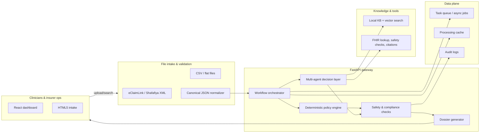

# AI-Powered Healthcare Pre-Authorization Platform

[](https://opensource.org/licenses/MIT)
[](https://www.python.org/downloads/)
[](https://fastapi.tiangolo.com/)
[](https://reactjs.org/)

An intelligent pre-authorization platform for UAE healthcare insurance that processes XML and CSV healthcare data into FHIR-compliant canonical JSON. Built with FastAPI, React, and AI-powered decision support.

## 🚀 Features

### Core Functionality
- **Multi-Format Processing**: Support for XML (eClaimLink/Shafafiya) and CSV healthcare data
- **FHIR Compliance**: Complete FHIR R4 implementation with UAE healthcare extensions
- **AI-Powered Decisions**: Hybrid processing with deterministic rules and intelligent LLM routing
- **Real-time Analytics**: Dashboard with processing metrics and decision analytics
- **Professional Dossiers**: Automated generation of medical reports with clinical citations

### Processing Modes
- **Deterministic**: Policy rules only, no LLM calls, $0 cost
- **Hybrid**: Default mode, intelligent LLM routing, <$0.10 per case
- **Agentic**: Full LLM agent execution for complex cases, <$0.25 per case

### UAE Healthcare Integration
- **eClaimLink** (Dubai Health Authority): Complete XML parsing with validation
- **Shafafiya** (Abu Dhabi DOH): Native XML format support
- **ICD-10-AM**: UAE-specific diagnosis code mappings
- **CPT/HCPCS**: Procedure code normalization with UAE extensions
- **PDPL Compliance**: UAE Personal Data Protection Law adherence
- **Arabic Language**: Native RTL support for UI and reports

## 🏗️ Architecture

### Backend System
```
preauth_system/
├── orchestrator.py    # Main workflow orchestration
├── intake.py          # eClaimLink XML → Canonical mapping
├── summary.py         # Clinical data aggregation & FHIR integration
├── policy/            # Deterministic policy engine
│   ├── rules_engine.py
│   └── policies/      # YAML-based policy definitions
├── rag/              # Local knowledge base & retrieval
│   ├── kb_loader.py
│   ├── retrieve.py   # BM25 search with citations
│   └── tools.py      # Agent tools for KB queries
├── safety.py         # Drug interactions & risk assessment
├── decision.py       # Deterministic decision synthesis
├── compliance.py     # UAE PDPL & documentation auditing
└── dossier.py        # HTML report generation
```

### System Diagram


### Multi-Agent System
- **Roles**: clinical-analyzer (problem list, vitals), medication-specialist (drug interactions, dosing), risk-assessor (risks/contraindications), decision-maker (coverage proposal), compliance-auditor (PDPL + policy alignment)
- **Execution flow**: orchestrator fans out case context → agents run tools-first (kb_search, fhir_query, safety_check) → each returns rationale + confidence → decision-maker assembles recommendation → compliance-auditor validates before dossier generation.
- **Safeguards**: deterministic policy check runs in parallel; safety gate blocks unsafe plan; audit log captures agent traces.
- **Caching**: request/response caches for summaries, KB hits, and policy evaluations to reduce cost/latency.

### Frontend Applications
- **React Dashboard**: Modern TypeScript dashboard with real-time updates
- **HTML5 Interface**: Professional interface for simple deployment
- **Responsive Design**: Mobile-first approach with Tailwind CSS

## 🛠️ Installation & Setup

### Prerequisites
- Python 3.9+
- Node.js 18+
- `uv` package manager

### Backend Setup
```bash
# Clone the repository
git clone https://github.com/your-username/healthcare-ai-preauth.git
cd healthcare-ai-preauth

# Create virtual environment and install dependencies
uv venv .venv && source .venv/bin/activate
uv pip install -e .

# Start the FastAPI server
python api/run_server.py
```

### Frontend Setup
```bash
# Navigate to React app
cd ui-react

# Install dependencies
npm install

# Start development server
npm run dev
```

## 🧪 Testing the System

### 1. Interactive Demo (CLI)
```bash
python -m preauth_system.demo
```
Runs 3 test cases with complete pipeline processing and real-time decision making.

### 2. FastAPI Backend Testing
```bash
# Start the server
python api/run_server.py

# Test pipeline processing
curl -X POST http://localhost:8000/api/pipeline/process \
  -F "file=@data/dataset_2/synthetic_dataset/UAE_XML/Patient_007_eclaim.xml" \
  -F "source=eclaim" \
  -s | jq '.results.decision.outcome'
```

### 3. React Dashboard Testing
```bash
# Start both services
python api/run_server.py &
cd ui-react && npm run dev

# Access dashboard at http://localhost:3000
```

## 📊 Key Endpoints

| Endpoint | Method | Purpose |
|----------|---------|---------|
| `/api/process/unified` | POST | Multi-format processing with mode selection |
| `/api/pipeline/process` | POST | Complete pipeline processing |
| `/api/dossier/{analysis_id}` | GET | Professional HTML/PDF dossier generation |
| `/api/patients` | GET | Synthetic patient data management |
| `/api/dashboard/summary` | GET | Real-time analytics and metrics |
| `/api/health` | GET | System health monitoring |

## 🧬 Clinical Pathways

### Implemented Policies
- **Diabetes Technology Management**: Continuous glucose monitoring and insulin pump therapy
- **Osteoarthritis Knee Intervention**: Total knee arthroplasty and conservative treatments
- **Parkinson's Disease DBS**: Deep brain stimulation therapy assessment

### Policy Engine Features
- **Scoring System**: Percentage-based policy compliance
- **Evidence Requirements**: Clinical guidelines with specific citations
- **Tri-State Logic**: met/unmet/uncertain states with rationale
- **Version Control**: Policy versioning with effective dates

## 🔧 Development

### Code Quality Tools
```bash
# Format code
black . --skip-string-normalization

# Lint and fix
ruff check . --fix

# Run tests
pytest
```

### Package Management
- **Package Manager**: `uv`
- **Install dependencies**: `uv pip install -e .`
- **Virtual environment**: `uv venv .venv && source .venv/bin/activate`

### Project Structure
```
healthcare-ai-preauth/
├── api/                    # FastAPI backend services
├── preauth_system/         # Core processing pipeline
├── ui-react/              # React frontend application
├── ui/                    # HTML5 interface assets
├── tests/                 # Unit and integration tests
├── schemas/               # FHIR mapping and data schemas
├── samples/               # Sample XML/CSV data files
├── docs/                  # System documentation
└── kb/                    # Knowledge base content
```

## 📈 Performance Metrics

### Processing Results
- **Patient_007**: 100% policy compliance, APPROVE decision
- **Patient_005**: 20% policy compliance, REVIEW required
- **Patient_011**: 18% policy compliance, DENY recommendation

### Cost Optimization
- **Deterministic Mode**: $0.00 per case
- **Hybrid Mode**: <$0.10 per case
- **Agentic Mode**: <$0.25 per case

### Performance
- **Processing Time**: ~30-40 seconds per case
- **API Response**: <200ms for cached queries
- **Dashboard Updates**: Real-time WebSocket connections

## 🔐 Security & Compliance

- **PDPL Compliance**: UAE Personal Data Protection Law adherence
- **FHIR Security**: OAuth 2.0 and SMART on FHIR implementation
- **Data Encryption**: AES-256 encryption for sensitive data
- **Audit Trail**: Complete processing logs for regulatory compliance
- **Access Control**: Role-based permissions and audit logging

## 🌐 Deployment

### Production Deployment
```bash
# Build React app
cd ui-react && npm run build

# Start production server
uvicorn api.main:app --host 0.0.0.0 --port 8000
```

### Docker Support
```dockerfile
# Dockerfile example included in repository
docker build -t healthcare-ai-preauth .
docker run -p 8000:8000 healthcare-ai-preauth
```

## 📚 Documentation

- **[System Architecture](docs/system_design.md)** - Complete technical implementation
- **[FHIR Implementation Guide](docs/FHIR_GUIDE.md)** - UAE healthcare data standards
- **[API Documentation](http://localhost:8000/docs)** - Interactive OpenAPI specification
- **[Development Guidelines](CLAUDE.md)** - Development patterns and best practices

## 🤝 Contributing

We welcome contributions! Please see our [Contributing Guidelines](CONTRIBUTING.md) for details.

### Development Process
1. Fork the repository
2. Create a feature branch
3. Make your changes
4. Add tests for new functionality
5. Submit a pull request

## 📄 License

This project is licensed under the MIT License - see the [LICENSE](LICENSE) file for details.

## 🙏 Acknowledgments

- **FastAPI** - Modern, fast web framework for building APIs
- **React** - JavaScript library for building user interfaces
- **FHIR** - Fast Healthcare Interoperability Resources standard
- **UAE Health Authorities** - For healthcare data standards and specifications

---

**Built with ❤️ for the UAE healthcare community**

For support and inquiries: [Create an Issue](https://github.com/your-username/healthcare-ai-preauth/issues)
