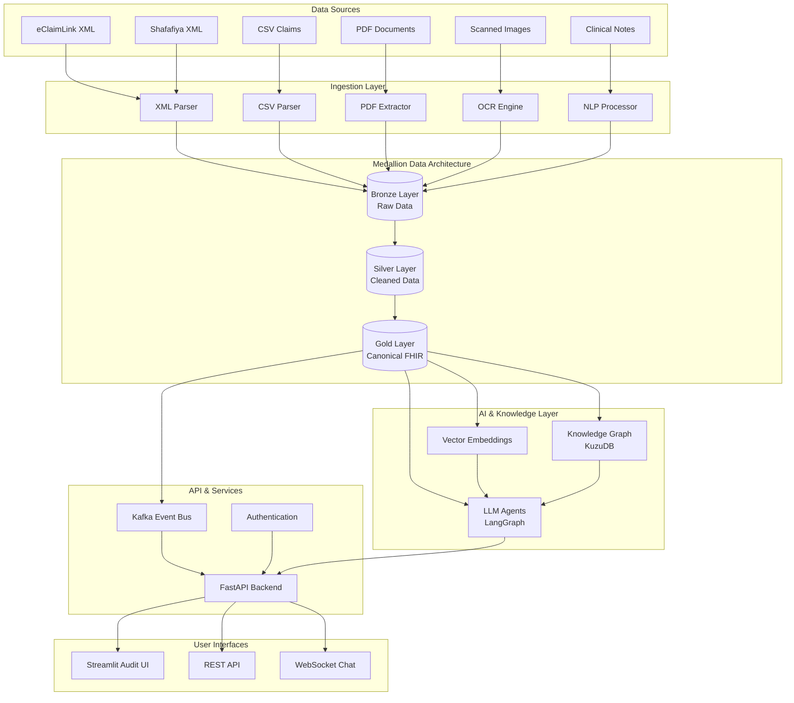

# Nazmito System Architecture

## Overview

Nazmito implements a modern, cloud-native architecture designed for scalable healthcare data processing with AI-powered clinical intelligence. The system follows a medallion architecture pattern with three data layers (Bronze, Silver, Gold) and employs event-driven processing with comprehensive audit trails.

## High-Level Architecture



## Medallion Data Architecture

### Bronze Layer (Raw Data)
**Purpose:** Immutable storage of original data artifacts
**Storage Format:** Original format preserved (XML, CSV, PDF bytes, OCR JSON)
**Key Features:**
- SHA-256 content hashing for integrity verification
- Complete lineage tracking with ingestion timestamps
- Immutable once written (compliance requirement)
- Support for all input formats without transformation

**Directory Structure:**
```
/data/bronze/
├── ingest_date=2025-07-31/
│   ├── eclaim_xml/
│   │   ├── prior_auth_001.xml
│   │   └── prior_auth_001.manifest.json
│   ├── shafafiya_xml/
│   ├── csv_claims/
│   ├── pdf_documents/
│   └── ocr_output/
```

### Silver Layer (Cleaned Data)
**Purpose:** Source-shaped data with basic cleansing and type casting
**Storage Format:** Parquet with partition by source system and date
**Transformations:**
- Data type normalization (dates, numbers, codes)
- Basic validation (required fields, format checks)
- Deduplication within ingestion batch
- Field mapping to common naming conventions

**Schema Example:**
```python
{
    "source_system": "eClaimLink",
    "record_id": "PA-2025-000123",
    "patient_id": "P123456789",
    "service_date": "2025-07-31T10:30:00Z",
    "activity_code": "83036",
    "diagnosis_codes": ["E11.9", "I10"],
    "amount": 250.00,
    "currency": "AED",
    "data_quality_score": 0.95,
    "processing_timestamp": "2025-07-31T14:20:00Z"
}
```

### Gold Layer (Canonical FHIR)
**Purpose:** Fully normalized, FHIR-compliant healthcare data
**Storage Format:** Parquet with FHIR resource partitioning
**Key Features:**
- Complete FHIR Claim + ServiceRequest compliance
- UAE-specific extensions properly namespaced
- Clinical enrichment with historical context
- Ready for downstream analytics and ML models

**FHIR Resources Used:**
- **Claim**: Primary authorization request structure
- **ServiceRequest**: Individual service/procedure requests
- **Observation**: Lab results, vital signs, clinical measurements
- **MedicationStatement**: Current and historical medications
- **Patient**: Demographic and insurance information (when available)

## Pipeline Components

### XML Ingestion Engine
**Technologies:** Python xmlschema, lxml
**Supported Formats:**
- eClaimLink 2019/11 PriorAuthorizationRequest
- Shafafiya 2011 Prior.Authorization
- Custom UAE payer formats (extensible)

**Processing Flow:**
1. Schema validation against XSD
2. Recursive element extraction with namespace handling
3. Code set validation (ICD-10-AM, CPT)
4. Mapping to canonical FHIR structure
5. Quality scoring with detailed metrics

### CSV Claims Parser
**Technologies:** Pandas, DuckDB for large files
**Capabilities:**
- Auto-detection of delimiter and encoding
- Header mapping with fuzzy matching
- Batch processing for large files (>1M rows)
- Memory-efficient streaming for massive datasets

### PDF Processing Pipeline
**OCR Stack:**
- **Tesseract 5.x** with Arabic language support for clear scans
- **TrOCR-base** (Vision Transformer) for challenging documents
- **Table-Transformer** (Microsoft) for complex table extraction

**Processing Stages:**
1. Text layer detection using pdfplumber
2. Table extraction with Camelot (lattice/stream modes)
3. OCR fallback for scanned pages
4. Layout analysis and content reconstruction
5. Structured data extraction with confidence scoring

### NLP Clinical Text Processor
**Model Stack:**
- **BERT-mini** fine-tuned for clinical NER (11M parameters)
- **Rule-based extractors** for ICD/CPT code mentions
- **Negation detection** using clinical NLP patterns
- **Confidence scoring** for manual review triage

**Training Data:**
- Asclepius Synthetic Clinical Notes (base corpus)
- UAE-specific clinical text snippets (augmentation)
- Custom annotations for regional terminology

## AI & Knowledge Graph Integration

### Vector Embeddings
**Model:** `intfloat/e5-small` (33M parameters)
**Implementation:**
- Sentence-level embeddings for clinical text
- Hybrid search combining vector similarity + BM25
- Real-time embedding generation for new content
- Batch reprocessing for model updates

### Knowledge Graph (KuzuDB)
**Schema Design:**
```cypher
CREATE NODE TABLE Patient(id STRING, demographics JSON, PRIMARY KEY(id));
CREATE NODE TABLE Claim(id STRING, status STRING, amount DOUBLE, PRIMARY KEY(id));
CREATE NODE TABLE Service(code STRING, description STRING, category STRING, PRIMARY KEY(code));
CREATE NODE TABLE Diagnosis(code STRING, description STRING, severity STRING, PRIMARY KEY(code));

CREATE REL TABLE HAS_SERVICE(FROM Patient TO Service, claim_id STRING, service_date DATE);
CREATE REL TABLE HAS_DIAGNOSIS(FROM Patient TO Diagnosis, encounter_id STRING, diagnosis_date DATE);
CREATE REL TABLE REQUIRES_SERVICE(FROM Diagnosis TO Service, strength DOUBLE, evidence_level STRING);
```

**Query Capabilities:**
- Clinical pathway analysis
- Drug-drug interaction detection
- Guideline adherence scoring
- Outcome prediction based on historical patterns

### LLM Agent Architecture (LangGraph + BAML)

**Agent Types:**
1. **Clinical Reasoning Agent**: Analyzes medical necessity and guidelines
2. **Cost Optimization Agent**: Identifies cost-effective alternatives
3. **Risk Assessment Agent**: Evaluates patient risk factors
4. **Explanation Agent**: Generates human-readable rationales

**BAML Configuration Example:**
```yaml
agents:
  clinical_reasoner:
    model: "gpt-3.5-turbo"
    max_tokens: 1000
    temperature: 0.1
    system_prompt: |
      You are a clinical decision support specialist analyzing prior authorization requests.
      Always cite specific clinical guidelines and provide evidence-based reasoning.

  cost_optimizer:
    model: "gpt-3.5-turbo"
    max_tokens: 500
    temperature: 0.0
    tools: ["drug_formulary_lookup", "procedure_cost_comparison"]
```

## API Layer Architecture

### FastAPI Backend
**Endpoints:**
- `POST /ingest` - File upload and processing initiation
- `GET /claim/{id}` - Retrieve processed claim with full lineage
- `GET /search` - Hybrid semantic + keyword search
- `POST /chat` - Conversational AI interface
- `GET /events` - Server-sent events for real-time updates

**Authentication & Authorization:**
- JWT tokens with configurable expiration
- Role-based access control (RBAC)
- API key management for system integrations
- Audit logging for all access attempts

### Event Streaming (Kafka)
**Topics:**
- `raw_ingestion` - New file arrivals
- `normalized_claim` - Successful FHIR conversions
- `quality_alerts` - Data quality failures
- `decision_events` - AI agent decisions
- `audit_trail` - All system activities

**Consumer Patterns:**
- Real-time dashboard updates
- Downstream system notifications
- ML model training triggers
- Compliance monitoring

## Deployment & Infrastructure

### Container Architecture
**Docker Services:**
- `api` - FastAPI backend
- `ui` - Streamlit interface
- `worker` - Celery background processing
- `kafka` - Event streaming
- `zookeeper` - Kafka coordination
- `kuzu` - Graph database
- `redis` - Caching and session storage

### Production Considerations
**Scalability:**
- Horizontal scaling for API and worker containers
- Partitioned Kafka topics for high throughput
- KuzuDB clustering for large knowledge graphs
- CDN caching for static assets

**Monitoring:**
- Health checks for all services
- Prometheus metrics collection
- Structured logging with correlation IDs
- Performance tracking with OpenTelemetry

**Security:**
- Network segmentation with Docker networks
- Secret management with HashiCorp Vault
- Regular security scanning of container images
- Encrypted communication between services

## Data Quality & Governance

### Quality Scoring Framework
**Dimensions Evaluated:**
1. **Completeness** (0-100): Percentage of required fields populated
2. **Validity** (0-100): Adherence to code sets and format rules
3. **Consistency** (0-100): Internal logical consistency checks
4. **Timeliness** (0-100): Recency of data relative to service dates

**Composite Score Calculation:**
```python
quality_score = (
    0.4 * completeness_score +
    0.3 * validity_score +
    0.2 * consistency_score +
    0.1 * timeliness_score
)
```

### Audit & Compliance Features
**Immutable Audit Logs:**
- Every data transformation logged with before/after states
- User actions tracked with timestamps and session context
- AI model decisions recorded with input data and reasoning
- Compliance officer access to complete audit trails

**Data Lineage Tracking:**
- Source-to-Gold layer transformation mapping
- Model version tracking for AI decisions
- Change history for all clinical rules
- Impact analysis for system updates

## Integration Patterns

### UAE Healthcare System Integration
**eClaimLink Integration:**
- SFTP batch file processing
- Real-time API endpoints (future)
- Webhook notifications for status updates
- Error handling with provider notifications

**Shafafiya Integration:**
- Web service API consumption
- XML message queue processing
- Status synchronization
- Compliance reporting

### FHIR Interoperability
**Supported Operations:**
- FHIR R4 resource validation
- Bulk data export in NDJSON format
- SMART on FHIR authentication (planned)
- HL7 message queue integration (future)

## Performance Characteristics

### Throughput Targets
- **XML Processing**: 1,000 documents/minute
- **CSV Processing**: 100,000 rows/minute
- **PDF Processing**: 100 pages/minute
- **API Response Time**: <500ms for 95th percentile
- **Search Queries**: <200ms for semantic search

### Storage Estimates
- **Bronze Layer**: ~10GB per 100K claims (including PDFs)
- **Silver Layer**: ~2GB per 100K claims (Parquet compression)
- **Gold Layer**: ~3GB per 100K claims (FHIR overhead)
- **Vector Embeddings**: ~500MB per 100K claims
- **Knowledge Graph**: ~1GB per 1M relationships

This architecture provides a robust, scalable foundation for intelligent healthcare authorization processing while maintaining compliance with UAE regulations and international healthcare standards.
