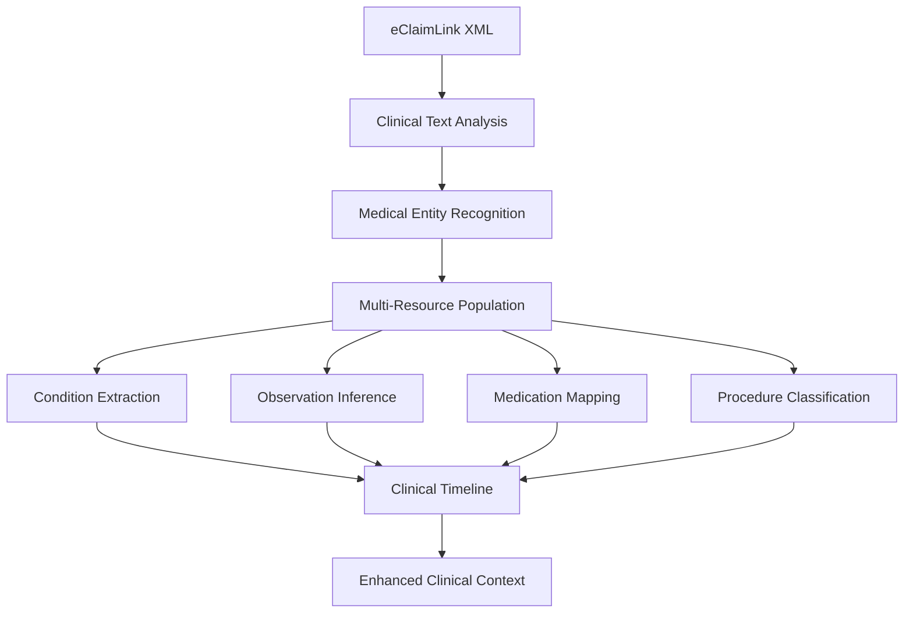

# Clinical Context Extraction Patterns for UAE Healthcare Data

## Overview

This document defines comprehensive patterns for extracting rich clinical context from both eClaimLink and Shafafiya XML formats to populate all 5 FHIR resources (Claim, Observation, MedicationStatement, Condition, Procedure) with enhanced clinical intelligence.

## Clinical Intelligence Strategy

### **Core Principle**: 
Transform static healthcare authorization data into dynamic clinical intelligence by:
1. **Multi-resource data synthesis** - Extract clinical meaning across all FHIR resources
2. **Temporal relationship modeling** - Build clinical timelines and care pathways  
3. **Evidence-based reasoning** - Link observations to conditions, procedures to outcomes
4. **Clinical context inference** - Use AI/NLP to extract implicit clinical information

---

## 1. eClaimLink Clinical Context Extraction

### 1.1 Primary Data Sources

| **XML Element** | **Clinical Intelligence Value** | **FHIR Resource Target** |
|---|---|---|
| `JustificationText` | **Primary clinical narrative** - Rich source for conditions, medications, observations | All resources |
| `ServiceRequest/ActivityCode` | **Procedure/diagnostic intentions** - Maps to procedures and observations | Procedure, Observation |
| `ServiceRequest/DiagnosisCode` | **Clinical conditions** - Primary and secondary diagnoses | Condition |
| `ServiceRequest/ActivityInstructions` | **Clinical reasoning** - Provider's clinical thinking | All resources |
| `ServiceRequest/ActivityDateTime` | **Clinical timeline** - Temporal sequencing of care | All resources |

### 1.2 Clinical Context Patterns

#### **Pattern 1: Diabetes Management Context**
```xml
<JustificationText>35-year-old patient with Type 2 Diabetes Mellitus, poorly controlled (last HbA1c 9.2% from 6 months ago). Recent fasting glucose levels consistently above 250 mg/dL despite maximum metformin therapy.</JustificationText>
```

**Extracted Clinical Context:**
- **Condition**: Type 2 Diabetes Mellitus (E11.9) - poorly controlled
- **Observation**: HbA1c = 9.2% (historical, 6 months ago)
- **Observation**: Fasting glucose >250 mg/dL (recent pattern)
- **MedicationStatement**: Metformin (maximum dose, inadequate response)
- **Clinical Timeline**: 6-month progression of poor control

#### **Pattern 2: Preventive Care Context**
```xml
<ServiceRequest>
    <ActivityCode>92014</ActivityCode>
    <DiagnosisCode>H36.0</DiagnosisCode>
    <ActivityInstructions>Comprehensive eye examination with ophthalmoscopy for diabetic retinopathy screening - patient reports visual symptoms</ActivityInstructions>
</ServiceRequest>
```

**Extracted Clinical Context:**
- **Procedure**: Comprehensive eye exam (92014) - screening intent
- **Condition**: Diabetic retinopathy (H36.0) - suspected
- **Clinical Reasoning**: Preventive screening + symptomatic evaluation
- **Risk Stratification**: High-risk diabetes patient with symptoms

### 1.3 Multi-Resource Synthesis

#### **Clinical Intelligence Pipeline for eClaimLink:**



---

## 2. Shafafiya Clinical Context Extraction

### 2.1 Primary Data Sources

| **XML Element** | **Clinical Intelligence Value** | **FHIR Resource Target** |
|---|---|---|
| `Comments` | **Clinical justification** - Provider reasoning and patient context | All resources |
| `Activity/Code` | **Procedure codes** - Clinical interventions and diagnostics | Procedure, Observation |
| `Activity/Observation` | **Direct clinical observations** - Lab values, vital signs, findings | Observation |
| `Activity/Type` | **Activity classification** - Distinguishes procedures, medications, diagnostics | All resources |
| `Authorization/Start/End` | **Treatment timeline** - Clinical care period | All resources |

### 2.2 Enhanced Observation Processing

#### **Shafafiya Advantage: Embedded Observations**
```xml
<Activity>
    <Code>83036</Code>
    <Type>3</Type>
    <Observation>
        <Type>LAB</Type>
        <Code>HBA1C</Code>
        <Value>9.2</Value>
        <ValueType>PERCENT</ValueType>
    </Observation>
</Activity>
```

**Clinical Intelligence Extraction:**
- **Primary Procedure**: HbA1c test (83036)
- **Observation**: HbA1c = 9.2% (structured data)
- **Clinical Interpretation**: Poor diabetic control (>7% target)
- **Care Gap**: >3 months since last test (inferred from authorization timing)
- **Risk Assessment**: High risk for complications

### 2.3 Temporal Clinical Intelligence

#### **Pattern: Care Sequence Analysis**
```xml
<Authorization>
    <Start>25/07/2025 00:00</Start>
    <End>25/07/2025 00:00</End>
    <Comments>Patient with poorly controlled diabetes; last HbA1c 9 months ago. No retinopathy screen in 18 months.</Comments>
    
    <Activity>
        <Code>83036</Code> <!-- HbA1c -->
    </Activity>
    <Activity>
        <Code>92014</Code> <!-- Eye exam -->
    </Activity>
</Authorization>
```

**Clinical Timeline Intelligence:**
- **Care Gap Analysis**: 9 months since last HbA1c (>3 month standard)
- **Screening Overdue**: 18 months since retinopathy screen (>12 month standard)
- **Coordinated Care**: Same-day authorization for related services
- **Preventive Intent**: Comprehensive diabetes complication screening

---

## 3. Cross-Format Clinical Intelligence Patterns

### 3.1 Medication Context Inference

#### **From Procedure Codes to Medication History:**

| **CPT Code** | **Clinical Inference** | **MedicationStatement Creation** |
|---|---|---|
| `90782` (Therapeutic injection) | Patient receiving injectable medications | Infer insulin, GLP-1 agonists, or other injectables |
| `96365` (IV infusion) | IV medication administration | Infer chemotherapy, antibiotics, or fluid therapy |
| `90471` (Immunization) | Vaccination administration | Extract vaccine type from diagnosis codes |

#### **From Clinical Text to Medication Context:**
```
"despite maximum metformin therapy" → MedicationStatement: Metformin 1000mg BID, inadequate response
"patient on ACE inhibitor" → MedicationStatement: ACE inhibitor (unspecified), active
"insulin naive patient" → MedicationStatement: No previous insulin use (negative assertion)
```

### 3.2 Condition Severity and Status

#### **Clinical Context Clues for Condition Classification:**

| **Clinical Phrase** | **Condition Status** | **Severity** | **FHIR Coding** |
|---|---|---|---|
| "poorly controlled diabetes" | Active | Moderate-High | clinicalStatus: active, severity: moderate |
| "resolved hypertension" | Resolved | N/A | clinicalStatus: resolved |
| "suspected retinopathy" | Provisional | Mild | verificationStatus: provisional |

### 3.3 Observation Clinical Intelligence

#### **Lab Value Interpretation Patterns:**

```json
{
  "resourceType": "Observation",
  "code": {
    "coding": [{"system": "http://loinc.org", "code": "4548-4", "display": "Hemoglobin A1c"}]
  },
  "valueQuantity": {
    "value": 9.2,
    "unit": "%"
  },
  "interpretation": [
    {"coding": [{"system": "http://terminology.hl7.org/CodeSystem/v3-ObservationInterpretation", "code": "H", "display": "High"}]}
  ],
  "extension": [
    {
      "url": "https://nazmito.com/extensions/clinical-significance",
      "valueString": "Significantly elevated HbA1c indicates poor glycemic control, increasing risk for diabetic complications. Target <7% for most adults."
    }
  ]
}
```

---

## 4. AI-Powered Clinical Context Enhancement

### 4.1 Natural Language Processing Pipeline

#### **Clinical NLP Extraction Chain:**
1. **Medical Entity Recognition** → Extract diseases, medications, procedures
2. **Temporal Expression** → Identify timeframes, sequences, durations  
3. **Clinical Reasoning** → Understand provider logic and decision-making
4. **Risk Assessment** → Calculate clinical risk scores and care gaps
5. **Care Coordination** → Identify related services and clinical pathways

### 4.2 Clinical Intelligence Scoring

#### **Context Quality Metrics:**

| **Metric** | **Calculation** | **Clinical Value** |
|---|---|---|
| **Clinical Completeness** | (Populated FHIR resources / 5) × 100% | Comprehensive patient view |
| **Temporal Richness** | Historical data points / Total observations | Clinical timeline depth |
| **Evidence Linkage** | Cross-referenced resources / Total resources | Clinical reasoning strength |
| **Care Gap Detection** | Identified gaps / Screening opportunities | Preventive care optimization |

---

## 5. Implementation Guidelines

### 5.1 Clinical Context Extraction Pipeline

```python
def extract_clinical_context(xml_data, format_type):
    """
    Enhanced clinical context extraction for both formats
    """
    clinical_context = {
        'conditions': extract_conditions(xml_data, format_type),
        'observations': extract_observations(xml_data, format_type),
        'medications': infer_medications(xml_data, format_type),
        'procedures': classify_procedures(xml_data, format_type),
        'clinical_timeline': build_timeline(xml_data, format_type),
        'care_gaps': identify_care_gaps(xml_data, format_type)
    }
    
    return enhance_with_clinical_intelligence(clinical_context)
```

### 5.2 Quality Assurance

#### **Clinical Context Validation:**
- **Medical Accuracy**: Validate extracted clinical data against medical guidelines
- **Temporal Consistency**: Ensure timeline logic and sequence accuracy
- **Cross-Resource Coherence**: Verify relationships between FHIR resources
- **Regulatory Compliance**: Maintain UAE healthcare standards and privacy requirements

---

## 6. Expected Clinical Intelligence Outcomes

### 6.1 Enhanced Authorization Decisions

#### **Before (Basic XML Processing):**
```
"Patient requests HbA1c test"
→ Decision: "Covered service for diabetes diagnosis"
→ Processing: Rule-based approval
```

#### **After (Clinical Context Extraction):**
```
"Patient requests HbA1c test"
→ Clinical Context: "35-year-old with poorly controlled T2DM (last HbA1c 9.2%, 6 months ago), on max metformin, developing symptoms"
→ Decision: "Approved with recommendation for diabetes education and retinopathy screening due to poor control"
→ Processing: Evidence-based clinical intelligence
```

### 6.2 Clinical Care Optimization

- **Preventive Care Identification**: Automated detection of overdue screenings
- **Care Gap Closure**: Proactive identification of missing clinical services  
- **Risk Stratification**: AI-powered patient risk assessment
- **Care Coordination**: Intelligent grouping of related clinical services
- **Cost Optimization**: Evidence-based approval with clinical justification

This clinical context extraction framework transforms static healthcare data into actionable clinical intelligence, enabling Nazmito to provide superior authorization decisions while improving patient outcomes and reducing healthcare costs.