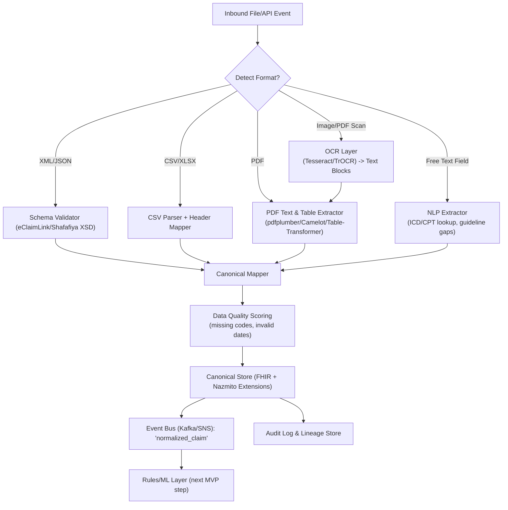

### MVP scope (data layer first)

**Goal:** Prove you can ingest the real formats UAE payers/TPAs use (Shafafiya/eClaimLink XML, CSV batches, PDFs with tables, scanned images), normalize them to a canonical schema (FHIR Claim/ClaimResponse + your own “AuthEnrichment” object), run basic rule checks + enrichment, and emit an auditable decision object.

**90-day MVP deliverables (data layer only):**

1. **Connectors & parsers** for 4 modalities:

   * Structured: CSV/XLS/X12-like, JSON/XML (eClaimLink/Shafafiya).
   * Semi/unstructured: PDF (text + tables), DOCX.
   * Image scans (JPG/PNG inside PDFs) → OCR.
   * Free text snippets (clinical notes, justification fields).
2. **Unified ingestion pipeline** that: detect file type → extract text/tables → map to canonical schema → validate/score data quality → store raw + normalized → emit events to downstream rules.
3. **Canonical schema v0.1** (FHIR Claim, ClaimResponse, ServiceRequest, Observation, MedicationStatement + Nazmito extensions for incentives/gap flags).
4. **Data quality and lineage module**: basic checks (missing ICD/CPT, code set validity), log transformations, keep original artifacts.
5. **Audit-ready storage**: Raw (“bronze”), cleaned (“silver”), normalized (“gold”) layers with immutable logs.
6. **Synthetic demo dataset loaded** and one end-to-end record flowing through to a JSON “decision packet” with rationale placeholders.

---

## What data really looks like (and where to get it)

* **UAE rails (real specs):**

  * **eClaimLink (Dubai Health Authority)**: XML schemas/XSDs and provider manuals with sample fields for Prior Authorization and claims.
  * **Shafafiya (Department of Health Abu Dhabi)**: dictionary for “Prior Request/Authorization” and web-service specs.
    These show the exact tags you must parse (Activity.Type, DenialCode, EncounterID, etc.). ([eclaimlink.ae][1], [eclaimlink.ae][2], [Department of Health Abu Dhabi][3], [Department of Health Abu Dhabi][4], [isahd.ae][5])

* **Synthetic claims to practice on (open):**

  * **CMS DE-SynPUF (US Medicare)**: large, realistic claims CSV files, free download. ([Centers for Medicare & Medicaid Services][6], [Centers for Medicare & Medicaid Services][7])
  * **Synthea (MITRE)**: generates 1M synthetic patient records in FHIR, C-CDA, CSV; includes encounters, procedures, meds—great to emulate UAE schemas. ([synthea.mitre.org][8], [mitre.github.io][9], [synthetichealth.github.io][10])

* **Table/PDF extraction training/benchmarks:**

  * **PubTables-1M (CVPR’22)** and **PubTabNet**: 1M+ tables from PDFs; useful to test/benchmark your table extractor. ([CVF Open Access][11], [arXiv][12], [GitHub][13], [Hugging Face][14])
  * **Microsoft Table-Transformer repo** provides code/models for PDF table extraction. ([GitHub][15])

* **Free-text clinical notes (synthetic):**

  * **Asclepius-Synthetic-Clinical-Notes** (HF) for NLP pipelines on justification text. ([Hugging Face][16])

*(Links below in a code block as requested.)*

```text
UAE specs & samples
- eClaimLink XSD & manuals: https://www.eclaimlink.ae/dhd/commontypes_20191113_xsd.html
- eClaimLink Provider Manual (PDF): https://eclaimlink.ae/eClaimLink/Samples/eClaimLink_Provider_Manual.pdf
- Shafafiya Prior Request/Authorization dictionary: https://www.doh.gov.ae/en/shafafiya/dictionary/Prior-Request-Authorization
- Shafafiya portal (all standards): https://www.doh.gov.ae/en/shafafiya

Synthetic claims / EHR
- CMS DE-SynPUF: https://www.cms.gov/data-research/statistics-trends-and-reports/medicare-claims-synthetic-public-use-files
- Synthea downloads (FHIR/CSV): https://synthea.mitre.org/downloads

PDF tables & OCR benchmarks/tools
- PubTables-1M paper: https://openaccess.thecvf.com/content/CVPR2022/papers/Smock_PubTables-1M_Towards_Comprehensive_Table_Extraction_From_Unstructured_Documents_CVPR_2022_paper.pdf
- PubTabNet dataset: https://paperswithcode.com/dataset/pubtabnet
- HF mirror of PubTables-1M: https://huggingface.co/datasets/bsmock/pubtables-1m
- Microsoft Table Transformer: https://github.com/microsoft/table-transformer

Synthetic clinical text
- Asclepius Synthetic Notes: https://huggingface.co/datasets/starmpcc/Asclepius-Synthetic-Clinical-Notes
```

---

## Data modalities you must handle

1. **Structured transactional feeds** (CSV/Excel, XML/JSON): most claims and prior-auth payloads from Shafafiya/eClaimLink are XML or flat files. ([eclaimlink.ae][1], [Department of Health Abu Dhabi][3])
2. **Semi-structured PDFs** (provider uploads, lab reports, invoices): contain text and embedded tables.
3. **Scanned images inside PDFs** (faxed forms, stamped approvals): need OCR (Tesseract/TrOCR) before you can parse.
4. **Free-text fields** (clinical justification, notes): short paragraphs; NLP to extract diagnoses, labs due, etc.
5. **(Optional later) DICOM/radiology images** are rarely needed for PA logic; treat as URL/reference, not ingestion in MVP.

---

## Unified pipeline (Mermaid)



---

## MVP scope by weeks (data layer)

**Weeks 1–2:**

* Lock canonical schema (FHIR resources subset + Nazmito fields).
* Implement XML (eClaimLink/Shafafiya) validator + mapper.
* Load CMS/Synthea samples into pipeline.

**Weeks 3–4:**

* Add CSV parser, data-quality scoring module.
* Build PDF table extractor path (Camelot/Table-Transformer baseline).
* OCR fallback for scanned PDFs.

**Weeks 5–6:**

* Implement NLP extraction for justification text (regex + small model).
* Store everything with lineage (raw/clean/normalized).
* Expose normalized JSON via API.

**Weeks 7–8:**

* Wrap in a small UI/log viewer for audit trails (raw vs normalized diff).
* Produce demo: upload XML/PDF → see normalized claim + preliminary “gap flags”.
* Prepare pilot data ingestion playbook (SFTP, API, batch).

---

### What comes next (after data layer)

* **Rules/ML layer MVP:** encode 10–15 diabetes/HTN gap rules + simple incentive suggestions.
* **Decision packet generator:** JSON output with approve/deny/refer, rationale, guideline citation.
* **Provider/Payer dashboards:** manual-touch %, time-to-decision, gaps closed.
* **Compliance artifacts:** DPIA template, logging policy.

When you’re ready, we’ll scope those layers.
