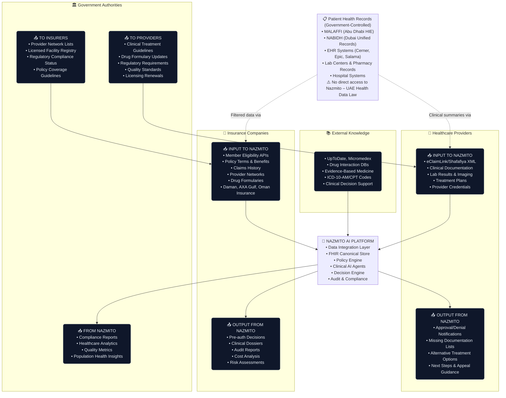
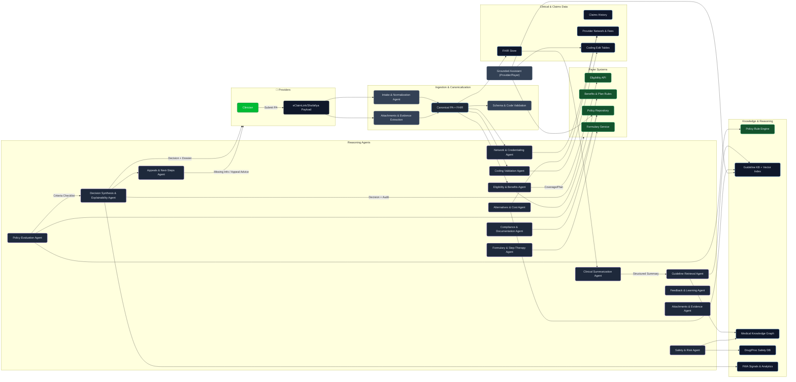

## AI-Driven Prior Authorization System (UAE)

This document outlines a best-in-class, production-grade, AI-driven prior authorization (PA) system designed for the UAE healthcare ecosystem (DHA/DOH, eClaimLink/Shafafiya). The design prioritizes speed, accuracy, cost-efficiency, explainability, and regulatory alignment. It combines deterministic policy/rule engines with retrieval-augmented LLM agents, a medical knowledge graph, and strict data governance.

### Design Goals
- **Faster**: Sub-minute end-to-end analysis in most cases; immediate decisions for clear-cut policy matches.
- **Cheaper**: Minimize LLM tokens with structured prompts, caching, and deterministic rule engines.
- **Easier**: Clear human-readable dossier for insurers/medical directors; minimal back-and-forth.
- **Explainable**: Each recommendation includes criteria mapping, citations (guidelines/policies), and evidence.
- **Standard**: Uses UAE formats (eClaimLink, Shafafiya) and global vocabularies (FHIR, ICD-10, CPT/HCPCS, LOINC, RxNorm, SNOMED CT) with local mappings.
- **Secure/Compliant**: PDPL-compliant data flows, consent management, audit trails, policy versioning.
- **Deterministic‑first**: Core decisions are driven by explicit rules first (eligibility/benefits, coding edits, network status, policy criteria); LLMs summarize and explain with citations.
- **Insightful**: Built-in analytics show turnaround times, approval/denial reasons, and emerging patterns (e.g., overutilization), helping payers refine policies and providers improve submissions.
- **Trustworthy**: Proactive fraud/waste/abuse (FWA) signals with plain-language explanations support reviewers without blocking appropriate care.

---

### System Modules: From Request to Decision

The Nazmito AI Platform orchestrates a sophisticated dance of specialized modules, agents, and Large Language Models (LLMs), each playing a distinct role in transforming prior authorization requests into explainable, auditable decisions. This modular architecture represents a paradigm shift from monolithic healthcare systems to a composable intelligence framework—one that mirrors how expert medical reviewers actually think, but with the consistency and speed that only AI can provide.

Imagine each module as a specialized expert in a virtual medical review committee. The system begins with a meticulous intake specialist who validates and normalizes incoming requests, followed by administrative gatekeepers who verify coverage and network status. Clinical experts then synthesize patient histories and retrieve relevant guidelines, while policy analysts apply deterministic rules with mathematical precision. Safety officers flag potential risks, and finally, a synthesis engine combines all perspectives into a coherent decision that can be explained to both providers and payers.

What makes this architecture particularly powerful for AI applications is its careful balance between deterministic rule-based processing and intelligent agent reasoning. Where possible, the system relies on explicit, auditable rules—ensuring consistency and regulatory compliance. Where nuanced clinical judgment is required, AI agents step in with carefully constrained roles, always grounding their reasoning in retrievable evidence and maintaining clear audit trails.

#### The Modular Journey: 15 Specialized Components

**1. Intake & Normalization**
- **Type:** Module (deterministic processing)
- **Objective:** Validate UAE XML formats, normalize to canonical structures, extract key clinical facts from attachments, and surface missing essentials early in the pipeline.
- **The Challenge:** Healthcare data arrives in diverse formats—eClaimLink XML from Dubai, Shafafiya XML from Abu Dhabi, PDF lab reports, scanned clinic notes. Each format has its own quirks, required fields, and validation rules. Without proper normalization, downstream modules would need to handle multiple data schemas, creating complexity and potential errors.
- **How It Works:** This module acts as the system's intelligent front door. It performs rigorous XML schema validation against UAE standards, then converts everything into a consistent FHIR-based canonical structure. Its most sophisticated capability is the intelligent processing of attached clinical documents. Using OCR and targeted extraction algorithms, it identifies and extracts only the most pertinent clinical facts—like "HbA1c 9.2% (elevated)" from a complex lab report or "6 weeks of physical therapy completed" from a clinic note. This ensures downstream modules receive precise, relevant data without drowning in document noise.
- **Real-World Example:** A provider submits a diabetes device request via eClaimLink with a 12-page endocrinology report attached. The module validates the XML structure, extracts the patient demographics and procedure codes, then scans the PDF to identify and extract only the relevant facts: recent HbA1c value, current medications, and prior therapy attempts. It flags that a required field (insurance member ID) is missing and provides a precise error message, preventing delays later in the process.
- **Inputs:** eClaimLink/Shafafiya XML payloads, PDF/image attachments, FHIR context for cross-referencing
- **Outputs:** Canonical PA object (FHIR-structured), extracted clinical facts with provenance, early document completeness checklist
- **Tools:** XML schema validators, OCR engines, redaction utilities for PHI protection

**2. Eligibility & Benefits**
- **Type:** Module (deterministic with API integration)
- **Objective:** Confirm active insurance coverage, determine PA necessity, snapshot benefit limits and accumulators with full audit trails.
- **The Challenge:** Before diving into clinical analysis, fundamental questions must be answered: Is the patient covered? Does this specific service require prior authorization under their plan? Have they reached annual limits? Processing requests for ineligible members or non-PA-required services wastes resources and creates provider frustration.
- **How It Works:** This module integrates with payer eligibility APIs to verify real-time coverage status. It maintains an intelligent cache with short time-to-live (TTL) to balance accuracy with performance. Beyond basic eligibility, it computes whether prior authorization is actually required for the specific service-plan combination, checks benefit accumulators (like annual device limits), and detects duplicate or recently active authorizations for the same member and service.
- **Real-World Example:** A request comes in for a continuous glucose monitor for a patient. The module queries the payer API and discovers the patient's insurance is active, but their plan includes a "diabetes management devices" benefit with a limit of one device per year. The system finds an approved CGM request from 3 months ago and flags this as a potential duplicate, routing the case for review rather than automatic processing.
- **Inputs:** Member ID, plan information, service date, payer eligibility/benefits data
- **Outputs:** Eligibility status, PA-required flag, benefit accumulators, comprehensive audit log, duplicate/open authorization alerts
- **Tools:** Eligibility API clients, short-TTL caching system, episode detection rules and indexing

**3. Network & Credentialing**
- **Type:** Module (deterministic with registry lookups)
- **Objective:** Verify provider network status, licensure compliance, and site-of-care appropriateness for the requested service.
- **The Challenge:** Insurers strongly prefer in-network providers for cost control and quality assurance. Some procedures require specific facility types or certifications. Approving out-of-network services or inappropriate sites can lead to coverage disputes and quality concerns.
- **How It Works:** This module cross-references provider identifiers against the payer's network registry and licensing databases. It verifies that both the requesting provider and the service facility are properly credentialed and that the proposed site is appropriate for the requested service. When issues are detected, it can suggest alternative in-network providers or more suitable facilities.
- **Real-World Example:** A cardiologist requests approval for a complex cardiac procedure at a small outpatient clinic. The module verifies the cardiologist is in-network but flags that the proposed facility lacks the required cardiac surgery certification. It suggests three nearby in-network hospitals with appropriate cardiac capabilities and provides their contact information.
- **Inputs:** Provider/facility identifiers, requested service codes, geographic location
- **Outputs:** Network status determination, licensure validation, site suitability assessment, alternative facility suggestions
- **Tools:** Network registries, licensure databases, site-of-care appropriateness rules

**4. Coding Validation & Payment Integrity**
- **Type:** Module (deterministic rule engine)
- **Objective:** Validate diagnosis-procedure relationships, detect billing irregularities, ensure modifier compliance, and verify code version accuracy.
- **The Challenge:** Medical coding errors are a leading cause of claim denials and delays. Diagnosis codes must logically support procedure codes, certain procedures cannot be billed together (bundling rules), and specific modifiers may be required. Catching these issues early prevents avoidable denials and appeals.
- **How It Works:** This module applies sophisticated edit rules to validate coding accuracy. It checks that diagnosis codes (ICD-10) appropriately support the requested procedures (CPT/HCPCS), identifies "unbundling" violations where component services are inappropriately billed separately, and ensures required modifiers are present. It also validates that all codes are from current, accepted versions.
- **Real-World Example:** A provider submits a request for knee arthroscopy (CPT 29881) along with a separate code for surgical wound closure (12031). The module flags this as inappropriate unbundling since wound closure is included in the arthroscopy procedure. It also notices the diagnosis code is for shoulder pain (M25.511) rather than knee pain, flagging a diagnosis-procedure mismatch. The system provides corrected codes and clear explanations.
- **Inputs:** Diagnosis codes (ICD-10), procedure codes (CPT/HCPCS), modifiers, service location, dates
- **Outputs:** Coding validation report with pass/fail status, identified errors with suggested corrections
- **Tools:** Coding edit rules engine, modifier validation helpers, code version verification tables

**5. Formulary & Step-Therapy**
- **Type:** Module (deterministic with plan-specific rules)
- **Objective:** Verify formulary coverage, assess step-therapy compliance, validate quantity limits, and propose acceptable alternatives when appropriate.
- **The Challenge:** Insurance plans maintain formularies—carefully curated lists of covered medications and devices with associated rules. Many require "step therapy," where patients must try lower-cost alternatives before accessing premium options. Quantity and day-supply limits add another layer of complexity.
- **How It Works:** For medication and device requests, this module consults the patient's specific plan formulary to determine coverage status. It checks whether step-therapy requirements have been met by analyzing prior treatment history. It also validates that requested quantities fall within plan limits and suggests covered alternatives when appropriate.
- **Real-World Example:** A provider requests a GLP-1 diabetes medication (semaglutide) for a patient. The module checks the formulary and finds this drug is covered but requires step therapy—the patient must have tried metformin for at least 3 months. Reviewing the clinical history, it finds the patient was prescribed metformin 2 months ago. The system flags the unmet step requirement and calculates that step therapy will be satisfied in 4 weeks, providing the exact date when resubmission would be appropriate.
- **Inputs:** Requested medications/devices, quantities and duration, plan-specific formulary, patient's prior therapy history
- **Outputs:** Formulary coverage status, unmet step-therapy requirements with timelines, acceptable alternatives
- **Tools:** Formulary databases, step-therapy rule engines, therapeutic substitution lists

**6. Clinical Summarization**
- **Type:** Agent (LLM with structured outputs)
- **Objective:** Synthesize complex patient histories into concise, structured clinical snapshots that highlight information most relevant to the authorization decision.
- **The Challenge:** Modern patients often have extensive medical histories spanning multiple conditions, treatments, and providers. Downstream modules need essential clinical context without being overwhelmed by irrelevant details. The challenge is identifying what's clinically significant for the specific request at hand.
- **How It Works:** This intelligent agent processes the patient's FHIR history, claims data, and facts extracted from attachments to create a focused clinical narrative. It identifies key conditions, documents prior treatment attempts and their outcomes, highlights relevant risk factors, and summarizes the most recent diagnostic results. The output follows a structured format that downstream modules can reliably parse and utilize.
- **Real-World Example:** For a knee replacement request, the agent reviews a patient's 5-year history and extracts the essential elements: progressive osteoarthritis documented over 18 months, failed conservative treatments (NSAIDs for 6 months, physical therapy for 12 weeks, intra-articular injection 3 months ago), current pain level 8/10, and recent X-rays showing severe joint space narrowing. It ignores unrelated conditions like well-controlled hypertension and focuses on factors directly relevant to the orthopedic request.
- **Inputs:** FHIR patient history, canonical PA request, extracted facts from attachments
- **Outputs:** Structured clinical summary with key problems, prior therapy responses, relevant lab/imaging results, specialty-specific context
- **Tools:** FHIR query capabilities, limited knowledge base access for medical terminology, structured output formatting

**7. Guideline Retrieval**
- **Type:** Agent (RAG-powered with knowledge graphs)
- **Objective:** Identify and retrieve the most relevant policy sections and clinical guidelines with precise citations to ground authorization decisions in evidence.
- **The Challenge:** Clinical guidelines and insurance policies can span hundreds of pages. Human reviewers must locate relevant sections quickly and accurately. Manual searching is time-consuming and prone to missing important criteria or citing outdated information.
- **How It Works:** This agent employs Retrieval-Augmented Generation (RAG) combined with knowledge graph entity linking to efficiently locate relevant guidance. It processes the request details and clinical context to generate targeted queries, then searches across policy documents, clinical guidelines, and regulatory requirements. Results are ranked by relevance and returned with precise, clickable citations.
- **Real-World Example:** For a request for deep brain stimulation in Parkinson's disease, the agent searches across multiple sources and retrieves: (1) the specific policy section requiring "failure of optimal medical therapy for ≥6 months," (2) relevant American Academy of Neurology guidelines defining "optimal therapy," and (3) local DHA requirements for neurological procedures. Each excerpt includes the exact document, section, and page number for verification.
- **Inputs:** Requested procedure codes, diagnosis codes, structured clinical summary
- **Outputs:** Ranked, relevant policy and guideline excerpts with precise citations and confidence scores
- **Tools:** Vector/BM25 retrieval engines, knowledge graph entity linking, citation management system

**8. Policy Evaluation**
- **Type:** Module (deterministic rule engine)
- **Objective:** Apply explicit policy criteria from payers and regulatory bodies, generating clear checklists of met/unmet/uncertain requirements with supporting rationale.
- **The Challenge:** Insurance policies contain complex, interconnected criteria that must be evaluated systematically. Human reviewers may inconsistently interpret requirements or miss subtle dependencies between criteria. The goal is algorithmic consistency while maintaining transparency.
- **How It Works:** This module functions as a sophisticated rules engine, applying deterministic logic to evaluate policy criteria against the case facts. It processes temporal requirements ("at least 6 weeks of therapy"), clinical thresholds ("HbA1c >8.0%"), and prerequisite conditions. Each criterion is evaluated as met, unmet, or uncertain, with detailed rationale and identification of any missing documentation needed for complete evaluation.
- **Real-World Example:** For a diabetes device request, the module evaluates multiple criteria: (1) Type 1 or Type 2 diabetes diagnosis (MET - ICD-10 E11.9 present), (2) HbA1c ≥7.0% (MET - recent value 9.2%), (3) Multiple daily glucose checks (UNCERTAIN - patient reports checking but no log provided), (4) Diabetes education completion (UNMET - no certificate on file). It generates a precise list of missing items needed to satisfy uncertain/unmet criteria.
- **Inputs:** Canonical PA request, eligibility snapshot, coding validation results, clinical summary, retrieved policy excerpts
- **Outputs:** Criteria evaluation checklist (met/unmet/uncertain), missing documentation list, detailed rationale for each assessment
- **Tools:** Deterministic rule engine, temporal reasoning modules, evidence requirement mapping

**9. Safety & Risk Assessment**
- **Type:** Module (deterministic with optional AI synthesis)
- **Objective:** Identify contraindications, assess patient-specific risk factors, and recommend appropriate safety mitigations before proceeding with requested services.
- **The Challenge:** Patient safety is paramount, but risk assessment requires considering multiple factors: current medications, lab values, comorbidities, age, and the specific risks of the proposed intervention. Missing a significant contraindication could result in patient harm.
- **How It Works:** This module primarily relies on deterministic safety databases and rules to flag known contraindications and risk factors. It checks for drug interactions, laboratory value thresholds (like kidney function before contrast studies), age-related risks, and procedure-specific contraindications. For complex cases with multiple risk factors, an optional small LLM can synthesize the overall risk profile.
- **Real-World Example:** A patient with diabetes and chronic kidney disease requests a CT scan with contrast. The module flags: (1) LOW kidney function (eGFR 35 ml/min) creating HIGH risk for contrast-induced nephropathy, (2) concurrent metformin use requiring temporary discontinuation, (3) age >65 adding additional risk. It recommends pre-hydration protocols and suggests considering alternative imaging (MRI without contrast) if clinically appropriate.
- **Inputs:** Current medications, laboratory values (especially eGFR, liver function), comorbidities, patient age, requested procedure details
- **Outputs:** Risk level assessment (LOW/MODERATE/HIGH/CRITICAL), specific safety flags with explanations, recommended mitigation strategies
- **Tools:** Drug/procedure safety databases, laboratory threshold rules, small LLM for complex risk synthesis

**10. Alternatives & Site-of-Care Optimization**
- **Type:** Module (deterministic with cost/outcome modeling)
- **Objective:** Identify clinically equivalent alternatives that may offer better safety profiles, lower costs, or improved convenience while maintaining therapeutic effectiveness.
- **The Challenge:** Multiple treatment options often exist for the same condition. The requested approach may not be the most cost-effective or carry unnecessary risks. However, any alternative suggestions must be clinically appropriate and policy-compliant.
- **How It Works:** When policy guidelines permit, this module identifies alternative treatments, procedures, or sites of care that could achieve similar outcomes. It considers factors like clinical effectiveness, safety profile, cost differentials, and site-of-care appropriateness. All suggestions include clear explanations of trade-offs and confirmation of policy acceptability.
- **Real-World Example:** A patient requests MRI of the lumbar spine at a hospital facility ($2,400). The module identifies three alternatives: (1) same MRI at an in-network imaging center ($800) with equivalent quality, (2) CT scan with similar diagnostic yield for this indication ($400), and (3) initial trial of physical therapy as recommended by guidelines before imaging ($200 for 6 weeks). Each option includes clinical rationale and cost comparison.
- **Inputs:** Requested service details, network fee schedules, safety assessment results, policy acceptability guidelines
- **Outputs:** Ranked alternative options with clinical rationale, cost comparisons, and trade-off analysis
- **Tools:** Fee schedule databases, network registries, clinical guideline knowledge base, cost-effectiveness algorithms

**11. Compliance & Documentation**
- **Type:** Module (deterministic with regulatory rule sets)
- **Objective:** Ensure adherence to UAE privacy laws (PDPL), verify documentation completeness, and provide guidance on information redaction when necessary.
- **The Challenge:** Healthcare data is subject to strict privacy regulations, and incomplete documentation is a major cause of authorization delays. The system must balance thorough review with privacy protection while providing clear guidance on what additional information is needed.
- **How It Works:** This module applies UAE Personal Data Protection Law (PDPL) requirements and insurer-specific documentation standards. It verifies that all required clinical documentation is present and complete, identifies any missing items with specific descriptions, and provides redaction guidance for sensitive information when documents must be shared.
- **Real-World Example:** For a psychiatric medication request, the module identifies that a specialist evaluation is required but missing. It specifies exactly what's needed: "Psychiatrist evaluation within past 90 days including current symptom assessment, prior medication trials with specific names and durations, and treatment response documentation." It also flags that any psychiatric notes must be redacted to remove non-essential personal information before submission.
- **Inputs:** Case documentation, policy-specific requirements, eligibility information
- **Outputs:** Compliance status assessment, precise missing documentation list, redaction advisories for PHI protection
- **Tools:** PDPL compliance checklists, documentation requirement matrices, privacy protection guidelines

**12. Decision Synthesis (Combiner)**
- **Type:** Module (deterministic logic engine)
- **Objective:** Integrate all upstream assessments into a final authorization decision (APPROVE/DENY/REVIEW) with transparent reasoning and specific conditions.
- **The Challenge:** Multiple modules provide different perspectives on the same request—eligibility, clinical appropriateness, safety, compliance. These must be synthesized into a coherent decision that can be explained and defended. The logic must be consistent and auditable.
- **How It Works:** This module operates as a sophisticated decision tree, applying deterministic logic to combine all upstream signals. If all gates are satisfied (eligibility confirmed, network appropriate, coding valid, policy criteria met, safety acceptable), it generates an APPROVE with specific conditions like authorization duration. Clear violations result in DENY with precise reasons. Uncertain or borderline cases route to REVIEW with specific action items.
- **Real-World Example:** For a knee replacement request: Eligibility ✓, Network ✓, Coding ✓, Policy criteria 80% met (missing recent X-ray), Safety LOW risk. Decision: REVIEW. Specific requirement: "Submit knee X-rays from past 60 days showing severe joint space narrowing. Once provided, case can be auto-approved." The authorization is held pending this single, specific item.
- **Inputs:** Results from all upstream modules (eligibility, network, coding, formulary, clinical summary, policy evaluation, safety assessment, compliance check)
- **Outputs:** Final decision (APPROVE/DENY/REVIEW), confidence score, specific conditions or requirements, detailed reason codes
- **Tools:** Deterministic decision logic engine, reason code mapping system, confidence calculation algorithms

**13. Dossier Writer**
- **Type:** LLM (narrative generation with structured inputs)
- **Objective:** Transform structured decision data into comprehensive, human-readable reports that explain the authorization decision to both providers and payers in clear, professional language.
- **The Challenge:** Structured module outputs are precise but not easily digestible by human reviewers. Medical directors, providers, and patients need clear explanations of why decisions were made, what evidence was considered, and what steps are needed next.
- **How It Works:** This LLM-powered module takes the structured outputs from all previous modules and synthesizes them into professional narrative reports. It generates executive summaries, detailed criteria evaluations, clinical rationales, and actionable next steps. Importantly, the LLM explains and contextualizes decisions but does not make them—all core determinations come from upstream modules.
- **Real-World Example:** The system generates a comprehensive dossier stating: "This continuous glucose monitor request is APPROVED for 90 days based on documented Type 1 diabetes (E10.9) with HbA1c of 9.2% indicating suboptimal control. The patient meets all coverage criteria including diabetes education completion and multiple daily glucose monitoring. No safety contraindications identified. Prior authorization number: UAE-2024-001234. Device must be obtained from in-network durable medical equipment provider within 30 days."
- **Inputs:** Final decision object, clinical summary, policy evaluation results, retrieved evidence citations
- **Outputs:** Professional dossier with executive summary, detailed rationale, clinical context, and next steps; provider-facing summary with key points
- **Tools:** Medical narrative templates, citation formatting, bilingual generation capabilities (Arabic/English)

**14. Appeals & Next Steps**
- **Type:** Agent (context-aware guidance generation)
- **Objective:** Generate precise, actionable guidance for providers when requests require additional information or appeal processes, using exact policy language and case-specific context.
- **The Challenge:** When authorizations cannot be immediately approved, providers need specific guidance on next steps. Generic form letters create frustration and delays. The guidance must be precise, actionable, and reference the exact policy requirements.
- **How It Works:** This agent analyzes unmet criteria and missing documentation to generate tailored guidance. It can create specific checklists of required actions, draft appeal letters using exact policy language, and provide timelines for resubmission. All guidance is grounded in the specific case context and relevant policy excerpts.
- **Real-World Example:** For a partially denied request, the agent generates: "To proceed with this authorization, please provide: (1) Documentation of 6 weeks physical therapy with specific dates and therapy notes, (2) Current pain scale assessment, (3) Orthopedic surgeon evaluation confirming surgical candidacy. Based on policy section 4.2.1, resubmit within 60 days to maintain priority review status." It also drafts an appeal template if the provider disagrees with clinical requirements.
- **Inputs:** Unmet policy criteria, missing documentation list, provider specialty information, relevant policy excerpts
- **Outputs:** Specific action checklists, appeal letter templates, resubmission guidance with timelines
- **Tools:** Policy citation system, template libraries, context-aware content generation

**15. Policy Assistant (Provider/Payer)**
- **Type:** Agent (grounded Q&A with strict citation requirements)
- **Objective:** Provide real-time, grounded answers to policy questions from both providers and payers, ensuring all responses include verifiable citations and avoiding any speculative information.
- **The Challenge:** Providers and payers frequently have questions about coverage policies, documentation requirements, and coding guidelines. Phone calls and email inquiries create delays and inconsistent responses. Staff may provide outdated or incorrect information.
- **How It Works:** This chat-based assistant answers questions by searching approved policy documents, user guides, and coding references. It provides answers only when grounded in authoritative sources and always includes precise citations. It can also perform quick actions like identifying missing requirements or composing appeals based on the specific case context.
- **Real-World Example:** Provider asks: "What documentation is required for continuous glucose monitors in pediatric patients?" Assistant responds: "According to Policy Manual Section 12.4.3 (Updated March 2024), pediatric CGM requests require: (1) Pediatric endocrinologist evaluation, (2) Parent/caregiver diabetes education certificate, (3) Documentation of multiple daily finger stick logs, (4) HbA1c ≥7.0% for patients >6 years. Source: UAE Health Insurance Policy Manual v2024.1, pages 847-849."
- **Inputs:** Policy knowledge base, user guide libraries, coding reference materials, optional case context for personalized guidance
- **Outputs:** Precisely cited answers to policy questions, quick action summaries (missing items, appeal guidance)
- **Tools:** Retrieval system with citation guardrails, approved document repositories, quick action generators

#### The Orchestrated Flow: How Modules Work Together

This modular architecture creates a sophisticated workflow where each component contributes its specialized expertise while maintaining clear boundaries and responsibilities. The intake module ensures clean, standardized data flows to all downstream components. Administrative modules (eligibility, network, coding) act as efficient gatekeepers, resolving straightforward issues before expensive clinical analysis begins.

The clinical and policy modules form the analytical core, combining AI-powered summarization with deterministic rule application. Safety and compliance modules provide essential guardrails, while the decision synthesis module brings all perspectives together with mathematical precision.

Finally, the presentation layer (dossier writer, appeals guidance, policy assistant) transforms technical outputs into human-readable formats that facilitate communication between all stakeholders.

This design ensures that each authorization request follows a consistent, auditable path while allowing for the nuanced clinical reasoning that complex cases require. The result is a system that can process routine requests in seconds while providing thoughtful analysis for challenging cases—all with complete transparency and regulatory compliance.

---

### Core Data and Tooling
- **Canonical Data Layer**
  - FHIR store (Patient, Condition, Procedure, Medication, Observation, ImagingStudy, Coverage, Claim).
  - Claims store (historical approvals/denials, provider, site-of-care, LOS, cost).
  - UAE coding adapters: eClaimLink/Shafafiya → canonical model; mapping tables for ICD-10, CPT/HCPCS, LOINC, RxNorm, SNOMED CT.
  - Provider network and site-of-care registry; fee schedules and contracted rates.
  - Eligibility & benefits connectors and a short‑TTL cache (member active coverage, plan, accumulators, PA‑required flags).
  - Formulary & step‑therapy rules by plan; benefit accumulators and frequency limits.
  - Coding edit tables and bundling rules (UAE‑aligned), modifier and site‑of‑service helpers.

- **Data Sources to Nazmito Platform**


---

### FHIR Bundle Creation from Patient Data

**Core Architecture Principle:** FHIR Bundles serve as the single canonical data format, created through enrichment of simple patient CSV data to eliminate data duplication and provide optimal structure for AI/LLM consumption.

#### Data Flow: CSV → Enriched FHIR Bundle

The system transforms raw CSV patient data through a comprehensive enrichment process:

**1. Raw CSV Patient Data (Input):**
- Basic demographics: name, age, gender, insurance ID
- Simple clinical data: diagnosis codes, current medications, recent labs
- Administrative data: provider information, visit dates

**2. Enrichment Process:**
- **LOINC Code Addition**: Lab results enriched with standard LOINC codes for interoperability
- **RxNorm Code Mapping**: Medications mapped to RxNorm terminology for drug interaction analysis
- **Clinical Relationship Creation**: Establish proper FHIR resource relationships (Patient → Observation → Condition)
- **UAE-Specific Extensions**: Add emirate authority, regulatory flags, and local coding standards
- **Temporal Organization**: Structure historical data with proper effective dates and sequences

**3. FHIR Bundle Output (Canonical Format):**
```json
{
  "resourceType": "Bundle",
  "id": "enriched-patient-001",
  "type": "collection",
  "entry": [
    {"resource": {"resourceType": "Patient", "id": "P001", ...}},
    {"resource": {"resourceType": "Observation", "code": {"coding": [{"system": "http://loinc.org", "code": "4548-4"}]}, ...}},
    {"resource": {"resourceType": "MedicationStatement", "medicationCodeableConcept": {"coding": [{"system": "http://www.nlm.nih.gov/research/umls/rxnorm", "code": "6809"}]}, ...}},
    {"resource": {"resourceType": "Condition", "code": {"coding": [{"system": "http://hl7.org/fhir/sid/icd-10-am", "code": "E11.9"}]}, ...}}
  ]
}
```

#### Benefits of FHIR-First Architecture

**Single Source of Truth:**
- Eliminates data duplication between CSV, XML, and internal formats
- Reduces processing complexity by standardizing on one canonical format
- Ensures consistency across all system components

**Optimal for AI/LLM Processing:**
- **Structured Medical Codes**: LOINC, RxNorm, ICD-10-AM codes provide semantic meaning
- **Standardized Relationships**: FHIR resource references enable sophisticated clinical reasoning
- **Rich Clinical Context**: Proper observation categories, medication dosages, and temporal relationships
- **Evidence-Based Decisions**: Built-in support for clinical citations and guideline references

**Data Prioritization Strategy:**
When multiple data sources exist, the system prioritizes based on currency and accuracy:
1. **XML Request Data** (highest priority): Most current demographics and insurance information from active requests
2. **Recent CSV Clinical Data**: Laboratory results, medication changes within the last 3 months
3. **Historical Database Records**: Older clinical history for trend analysis and baseline establishment

**Processing Efficiency:**
- Single FHIR parsing pipeline instead of multiple format-specific processors
- Consistent validation rules across all data sources
- Unified clinical intelligence regardless of input format
- Streamlined regulatory compliance checking

#### Implementation Example

**Before (Multi-Format Chaos):**
```
CSV Data → Custom Parser → Internal Format A
XML Data → XML Parser → Internal Format B
Database → Query Results → Internal Format C
↓
Multiple data reconciliation steps
↓
Decision Engine (handling 3+ formats)
```

**After (FHIR-First):**
```
CSV Data → Enrichment Engine → FHIR Bundle
XML Data → FHIR Converter → FHIR Bundle (priority merge)
Database → FHIR Mapper → FHIR Bundle (historical context)
↓
Single FHIR Bundle (canonical)
↓
Decision Engine (one format, rich context)
```

This architecture ensures that regardless of whether patient data originates from CSV files, XML requests, or database queries, the clinical intelligence system always operates on consistently structured, semantically rich FHIR data with proper medical coding and clinical relationships.

---


### Decision Logic (Deterministic first, LLM when necessary)
- Approve if: eligibility/benefits confirmed AND policy criteria met AND coding valid AND in‑network/site suitable (or exception coded) AND risk acceptable AND compliant.
- Deny if: clear policy non‑coverage OR safety contraindication OR non‑compliance OR hard coding/network violations.
- Review if: uncertain criterion(s), borderline risk, or missing critical documentation. The LLM drafts readable justifications and summaries with embedded citations; it does not own the final decision when deterministic signals are strong.

---

### Cost, Latency, and Reliability Principles
- Minimize LLM calls: collapse tasks; prefer deterministic/rule/KG checks first.
- Use small models (e.g., gpt-4o-mini/haiku) for extraction/classification; reserve larger models for rare complex synthesis.
- Aggressive caching (eligibility, retrieval results, patient summaries, policy criteria trees, common requests).
- Strict prompt templates with structured outputs; hard token caps; streaming where helpful.
- Full audit trail: inputs, retrieved sources, versions, prompts, outputs, decision diffs.

---

### Mermaid Architecture


---

### Why this works for UAE
- Aligns with DHA/DOH rules while supporting payer-specific policies and local coding.
- Deterministic policy execution ensures repeatability and auditability; LLMs are used for summarization, retrieval justification, and dossier generation with citations, not opaque decisions.
- Built-in PDPL controls and documentation completeness checks reduce back-and-forth and denials.
- Operational analytics and explainable FWA signals help payers detect overutilization early and adjust policies proactively without penalizing appropriate care.
- Over time, the feedback loop calibrates confidence thresholds and reduces manual review load.

### Implementation Notes (high level)
- Start with a slim path: Intake → Eligibility → Clinical Summary → Policy Evaluation → Decision Synthesis.
- Wire RAG+KG for guideline citations; plug Drug DB for safety.
- Add Coding Validation, Network/Credentialing, Formulary checks to strengthen deterministic decisions.
- Add Alternatives & Appeals agents for incremental value.
- Maintain versioned policies & prompts; unit-test criteria trees; evaluate with historical adjudication data.

---


### Glossary (plain-English explanations)
- **Prior Authorization (PA)**: Advance approval from an insurer before a service/drug is provided, to confirm it is covered and medically necessary.
- **Payer / Insurer**: The insurance company or health plan that pays for covered medical services.
- **Provider**: A clinician or healthcare organization (e.g., hospital, clinic) delivering care.
- **DHA (Dubai Health Authority)**: Regulator for healthcare in Dubai; sets policies and standards.
- **DOH (Department of Health – Abu Dhabi)**: Regulator for healthcare in Abu Dhabi; sets policies and standards.
- **eClaimLink**: Dubai’s healthcare data exchange format/system used by providers and payers for claims and prior authorization.
- **Shafafiya**: Abu Dhabi’s healthcare data exchange format/system used by providers and payers for claims and prior authorization.
- **FHIR (Fast Healthcare Interoperability Resources)**: A standard format for exchanging healthcare data (patients, meds, labs, etc.).
- **ICD-10**: International codes used to identify diagnoses (e.g., type 2 diabetes, pneumonia).
- **CPT (Current Procedural Terminology)**: Codes for medical procedures (e.g., MRI, surgery). US-centric but commonly referenced; in UAE, CPT/HCPCS-style codes are often used/mapped.
- **HCPCS**: Procedure/ancillary codes (e.g., supplies, ambulance services); often used alongside CPT.
- **LOINC**: Codes for lab tests and clinical measurements (e.g., HbA1c, troponin).
- **RxNorm**: Standard names/codes for drugs (e.g., atorvastatin 20 mg).
- **SNOMED CT**: Comprehensive clinical terminology for conditions, findings, and procedures.
- **PDPL (UAE Personal Data Protection Law)**: UAE law governing personal data privacy and protection.
- **EHR (Electronic Health Record)**: The patient’s clinical record system used by providers.
- **LOS (Length of Stay)**: How long a patient stays in hospital or at a facility.
- **Fee Schedule**: A list of prices that a payer pays providers for services.
- **Site of Care**: The location/type of facility where care is delivered (e.g., hospital inpatient vs. outpatient center).
- **RAG (Retrieval-Augmented Generation)**: An AI pattern where relevant documents/guidelines are retrieved and fed into the model to answer with citations.
- **Knowledge Graph (KG)**: A network of medical concepts (conditions, procedures, drugs) and their relationships (e.g., “indicated_for”, “contraindicated_with”).
- **Vector Index / Embeddings / BM25**: Search technologies to find relevant text. Embeddings capture semantic meaning; BM25 is a classic keyword ranking algorithm.
- **Rule Engine / Deterministic**: A system that applies explicit, coded rules (no AI randomness) to decide if policy criteria are met.
- **LLM (Large Language Model)**: An AI model that generates or interprets text. Used here for summarization, drafting, and explaining—with citations.
- **ACR (American College of Radiology) Appropriateness Criteria**: Radiology guidelines for imaging tests.
- **NCCN (National Comprehensive Cancer Network)**: Oncology guidelines.
- **ADA (American Diabetes Association)**: Diabetes care guidelines.
- **GOLD (Global Initiative for Chronic Obstructive Lung Disease)**: COPD management guidelines.
- **ACC/AHA (American College of Cardiology/American Heart Association)**: Cardiology guidelines.
- **eGFR (estimated Glomerular Filtration Rate)**: A lab measure of kidney function used for dose/safety decisions.
- **SLA (Service-Level Agreement)**: Target timelines/expectations (e.g., decision within 24–72 hours).
- **Adjudication**: The payer’s process of making a decision on a claim or PA request.
- **Peer-to-peer (P2P) review**: A discussion between the provider and the payer’s clinician to resolve clinical questions.
- **Contraindication**: A reason why a treatment should not be used (e.g., drug interaction, allergy).
- **Comorbidity**: An additional medical condition present along with the primary one.
- **Claims**: Records of billed medical services and payments from past encounters.
- **Coverage**: What services a health plan pays for under a member’s policy.
- **Network / In-network**: Providers that have contracts with a payer (often lower patient cost and preferred for approvals).
- **Authorization Number**: The unique ID issued when a PA is approved.
- **Denial / Appeal**: A denial is a refusal to approve the request; an appeal asks the payer to reconsider, usually with more evidence.
- **Dossier**: A compiled, reader-friendly report with the full case analysis, evidence, and recommendation.
- **PHI (Protected Health Information)**: Personal medical information that must be safeguarded under privacy laws.
- **Temporal Reasoning**: Checking time-based criteria (e.g., “failed physical therapy for at least 6 weeks”).

---

### MVP v1.0

#### MVP definition (simplified, high‑signal)
- **Goal**: Demonstrate end‑to‑end, explainable prior authorization on 2–3 exemplar policies using the existing XML → unified record → LLM analysis → decision → dossier flow.
- **Must‑have outcomes**
  - **Input**: eClaimLink XML from `data/dataset_2/synthetic_dataset/UAE_XML/`
  - **Core steps**: Intake → Clinical summary → Evidence lookup (load full KB/policies) → Policy checklist (LLM) → Decision combine → Dossier
  - **Output**: Structured decision object + readable dossier with cited snippets (policy/KB filenames + sections)
  - **Latency target**: <8s on a laptop; **Cost**: <$0.10/request
- **Deferred** (post‑MVP)
  - Real eligibility/network connectors; code‑edits engine; step‑therapy engine; vector/BM25/KG retrieval; full compliance module

#### Architecture changes (preserve code, add clarity)
- **Keep** the asyncio orchestrator and current agents.
- **Add** a unified `dspy.Module` wrapper so the entire pipeline is callable/optimizable like a PyTorch model: `PreAuthPipeline(dspy.Module)`.
- **Use** DSPy where it makes sense:
  - `dspy.Predict` / `dspy.ChainOfThought` for Clinical summarization, Policy checklisting, Dossier
  - `dspy.ReAct` for tool‑use (load whole KB/policy files via functions in `preauth_system/dspy_tools.py`)
- **Simplify** agent scope for MVP:
  - Rename `clinical_analyzer` → ClinicalSummarizer with structured outputs
  - Add `PolicyEvaluator` (LLM) that converts “policy text + case” → criteria checklist (met/unmet/uncertain + rationale + citations)
  - Make `DecisionCombiner` deterministic over LLM outputs (no free‑form decision by LLM)
  - Keep `FinalReport` as DossierWriter, fed only structured inputs + citations

#### Proposed `dspy.Module` composition
- `PreAuthPipeline.forward(xml_path: str, xml_format="eclaim") -> Dict`
  - IntakeNormalizer (existing utils/etl) → canonical context
  - ClinicalSummarizer: `dspy.ChainOfThought(ClinicalAnalysis)` using the prepared context
  - EvidenceRetriever: `dspy.ReAct` selecting tools in `preauth_system/dspy_tools.py` to load full files (no retrieval infra)
  - PolicyEvaluator: `dspy.ChainOfThought(AuthorizationDecision)` but emitting a strict checklist schema:
    - `criteria: [{id, text, status: met|unmet|uncertain, rationale, citations:[source_id]}]`
    - `missing_documents: [text]`
  - DecisionCombiner: Python rules to map checklist → APPROVE/DENY/REVIEW + conditions
  - DossierWriter: `dspy.Predict(FinalReportSignature)` to render narrative from structured inputs
- Keep `PreAuthOrchestrator` as an adapter calling `PreAuthPipeline` so current CLI/tests keep working.

#### MVP Pipeline Data Flow (Implementation)

The following describes the actual data flow through the implemented MVP pipeline as documented in `preauth_system/pipeline_module.py`:

**1. Data Input & Intake Processing** (`_intake()`)
- **Goal**: Transform raw healthcare data into standardized, validated format ready for clinical analysis. Ensures data quality and completeness before expensive AI processing begins.
- **Input**: XML file path (eClaimLink/Shafafiya format)
- **Process**: 
  - Parse XML using `parse_xml()` and `extract_patient_info()`
  - Extract Emirates ID and find patient in database
  - Create unified patient record combining XML + historical data
  - Build canonical context via `prepare_pipeline_patient_data()`
- **Output**: 
  - Intake object with patient demographics, services, costs
  - Context object with enriched patient data and processing flags
  - Error handling with graceful degradation if parsing fails
- **Why Critical**: Poor data quality leads to incorrect decisions. This module ensures all downstream components receive clean, standardized patient information in FHIR format.

**2. Clinical Summarization** (LLM Agent - DSPy ChainOfThought)
- **Goal**: Extract and synthesize the most clinically relevant information from complex patient histories. Identifies key conditions, treatment responses, and clinical context that will drive authorization decisions.
- **Input**: Patient data from context
- **Process**: 
  - DSPy `ChainOfThought(ClinicalAnalysis)` with module-specific LM
  - Post-processing with confidence normalization (0-1 scale)
  - Structured output validation and field defaults
- **Output**: Clinical summary containing:
  - Executive summary of patient condition
  - Patient profile with key demographics
  - Timeline of relevant clinical events
  - Clinical appropriateness assessment
  - Recommendations for care
  - Confidence score (normalized 0-1)
- **Why Critical**: Raw patient data can span years and multiple conditions. This module identifies what matters for the specific authorization request, filtering out noise while preserving essential clinical context for policy evaluation.

**3. Evidence Retrieval** (ReAct Agent - DSPy with Tools)
- **Goal**: Find the specific insurance policies and clinical guidelines that apply to this patient's condition and requested treatment. Acts as an intelligent librarian that knows which "books" to pull from the knowledge base based on patient diagnosis and treatment request.
- **What It Finds**: Based on patient's condition (e.g., diabetes) and requested service (e.g., glucose monitor), identifies the relevant coverage policy (diabetes_technology.yaml) and supporting clinical evidence (diabetes management guidelines) that will be used to evaluate the authorization.
- **How It Works**: Uses patient diagnosis codes, requested procedures, and clinical context to intelligently select which policy documents and guidelines are most relevant, then extracts the specific sections that apply to this case.
- **Input**: Patient data + clinical summary
- **Process**: 
  - DSPy `ReAct(EvidenceRetrievalSignature)` with knowledge base tools
  - Limited to 2 tool calls for cost efficiency
  - Tools access policy files and clinical guidelines:
    - `diabetes_technology.yaml` (for diabetes device requests)
    - `osteoarthritis_knee_intervention.yaml` (for joint procedures)
    - `parkinsons_dbs.yaml` (for neurological devices)
    - Associated clinical guideline markdown files
- **Output**: List of evidence objects with:
  - Source identification (tool name mapped to file path)
  - Relevant policy/guideline excerpts
  - Structured snippets for downstream processing
- **Why Critical**: Without the right policy documents, the system cannot make informed authorization decisions. This module ensures only relevant, current policies are considered, avoiding both over-broad and too-narrow policy applications.

**4. Policy Evaluation** (LLM Agent - DSPy ChainOfThought) 
- **Goal**: Systematically evaluate whether the patient meets each specific criterion in the insurance policy. Acts as a meticulous clinical reviewer who checks patient facts against policy requirements one by one.
- **What It Evaluates**: Takes each policy requirement (e.g., "HbA1c ≥7.0%", "failed conservative therapy for 6+ weeks") and determines if the patient's clinical data satisfies that specific criterion.
- **How Decisions Are Made**: Compares patient's actual clinical data (from summary) against policy requirements (from evidence) to produce a systematic checklist of met/unmet/uncertain criteria with detailed rationale for each assessment.
- **Input**: Patient data + clinical summary + evidence excerpts
- **Process**:
  - DSPy `ChainOfThought(PolicyEvaluationSignature)` 
  - Post-processing with schema validation and citation verification
  - Citation validation against evidence sources provided
  - Status normalization to valid values (met/unmet/uncertain)
- **Output**: Policy checklist containing:
  - Criteria list with individual assessments (met/unmet/uncertain)
  - Rationale for each criterion evaluation
  - Missing documentation requirements
  - Overall compliance score (0-1)
  - Policy source citations validated against evidence
- **Why Critical**: This is where clinical facts meet policy requirements. Poor evaluation here leads to inappropriate approvals or denials. The systematic approach ensures every policy criterion is considered with clear reasoning.

**5. Decision Synthesis** (Deterministic Rules Engine)
- **Goal**: Transform the policy evaluation checklist into a final authorization decision using explicit, auditable rules. Acts as the final decision-maker who follows strict protocols to ensure consistent, defensible outcomes.
- **What It Decides**: Takes all the "met/unmet/uncertain" criteria assessments and applies predetermined business logic to reach APPROVE, DENY, or REVIEW decisions based on patterns of compliance, safety concerns, and documentation completeness.
- **Why Deterministic**: Uses explicit rules rather than AI to ensure 100% reproducible decisions that can be legally defended. Every decision path is documented and follows the same logic every time.
- **Decision Logic**: 
  - **DENY**: When explicit exclusions exist, safety contraindications are present, or mandatory criteria are unmet
  - **REVIEW**: When documentation is missing, criteria are uncertain, or compliance is borderline
  - **APPROVE**: When all required criteria are met and no blocking conditions exist
- **Input**: Policy checklist with validated criteria
- **Process**: 6-tier deterministic decision logic with comprehensive timing breakdown:
  - **Phase 1**: Criteria analysis and categorization
  - **Phase 2**: Pattern detection (mandatory, exclusions, safety)
  - **Phase 3**: Rule application with specific decision paths:
    - **DENY**: Explicit exclusions, safety blocks, unmet mandatory criteria
    - **REVIEW**: Missing critical docs (≥3), uncertain criteria, low compliance (<70%)
    - **APPROVE**: All conditions satisfied
  - **Phase 4**: Audit trail generation with complete reasoning
- **Output**: Comprehensive decision object with:
  - Final outcome (APPROVE/DENY/REVIEW)
  - Confidence score (1.0 for deterministic)
  - Reason codes and conditions
  - Detailed rationale with criteria breakdown
  - Complete audit trail with processing metrics
  - Timing breakdown for each decision phase
- **Why Critical**: This is where the system makes the actual authorization decision that affects patient care and insurer costs. Deterministic rules ensure consistency, auditability, and regulatory compliance while preventing AI "black box" decisions.

**6. Performance & Cost Tracking**
- **Timing**: Sub-second processing per phase with millisecond precision
- **Cost**: $0.00 for deterministic components, <$0.10 total per request
- **Audit**: Complete tracking of LLM usage, processing times, and decision logic
- **Error Handling**: Graceful degradation at each phase with fallback values

**Key Architecture Characteristics:**
- **Hybrid Processing**: Combines deterministic rules (fast, $0 cost) with intelligent LLM agents
- **Structured Outputs**: All LLM phases use validated schemas with post-processing
- **Citation Integrity**: Evidence sources tracked and validated throughout pipeline
- **Deterministic Decisions**: Final authorization decisions use explicit, auditable rules
- **Performance Optimization**: Module-specific LMs, aggressive error handling, timing optimization

This implementation achieves the MVP goals of <8 second processing time and <$0.10 cost per request while maintaining complete explainability and audit compliance.

#### Success criteria/KPIs
- ≥2 exemplar policies end‑to‑end with cited dossier: `diabetes_technology.yaml`, `osteoarthritis_knee_intervention.yaml` (DBS optional)
- Structured checklist quality: ≥80% correct vs hand‑curated expectations on demo cases
- Deterministic DecisionCombiner reproducibility: 100% for same inputs
- Observability: per‑phase timings + token/cost summary in output object

#### Day‑by‑day plan (Aug 14 onward)

##### Aug 14 — Scope lock, module skeletons, config
- [x] Update this section with “MVP v1.0” scope (done via this edit).
- [x] Create `preauth_system/pipeline_module.py` with `class PreAuthPipeline(dspy.Module)` and a `forward(...)` stub returning a typed dict.
- [x] Add minimal decision schema constants (APPROVE/DENY/REVIEW; reason codes).
- [x] Ensure `uv` env ready; add DSPy dependency.
  - [x] `uv add dspy`
- [x] Wire `configure_dspy_default()` to read `llm.default_model` from `preauth_system/config.yaml`.

Acceptance: `import preauth_system.pipeline_module:PreAuthPipeline` succeeds; `PreAuthPipeline().forward(... )` exists. ✅

##### Aug 15 — Intake adapter and context mapping
- [x] Harden `utils.parse_xml` / `extract_patient_info` to always return fields used downstream.
- [x] Implement `prepare_pipeline_patient_data(unified_record) -> signatures.PatientData`.
 - [x] Test with `Patient_007_eclaim.xml` fixture.

Acceptance: `PreAuthPipeline.forward(xml_path)` returns a dict with an intake/context block populated. ✅

##### Aug 16 — ClinicalSummarizer (LLM) with structured output
- [x] Implement `ClinicalSummarizer(dspy.Module)` using `dspy.ChainOfThought(ClinicalAnalysis)` and `ClinicalAnalysisOutput`.
- [x] Add a post‑processor that validates fields and clamps confidence 0–1.
- [x] Swap orchestrator Phase 1 to call this module (or route via `PreAuthPipeline`).

Acceptance: Summary returns executive_summary + recommendations; JSON serializable. ✅

##### Aug 17 — EvidenceRetriever (ReAct over simple tools)
- [x] Define a `ReAct` program with tools from `preauth_system/dspy_tools.py` (full‑file loaders only).
- [x] Cap to 2 tool calls; return list of snippets + source names.
- [x] Truncate long files; prioritize the exact YAML policy file for the request category.

Acceptance: For CGM, it loads `diabetes_technology.yaml` and returns ≥1 relevant excerpt. ✅

##### Aug 18 — PolicyEvaluator (LLM) with checklist schema
- [x] Implement `PolicyEvaluator(dspy.Module)` emitting strict checklist schema.
- [x] Validator to enforce schema and normalize statuses.
- [x] Prompts must cite filename/section from EvidenceRetriever.

Acceptance: Checklist is consistent across runs and cites provided sources. ✅

##### Aug 19 — DecisionCombiner (deterministic) and audit fields
- [x] Implement minimal rules:
  - APPROVE if all mandatory criteria met and no safety block
  - DENY if explicit non‑coverage criterion present
  - REVIEW for uncertain/unmet non‑mandatory or missing docs
- [x] Map checklist → reason codes, conditions.
- [x] Log per‑phase timings and token/cost usage.

**Implementation Notes**: DecisionCombiner logic integrated directly into `pipeline_module.py` rather than as a separate module. Features 6-tier deterministic decision logic with comprehensive timing breakdown, audit trail generation, and deterministic reproducibility. Decision constants recreated within the pipeline module for better cohesion.

Acceptance: Decision is deterministic and reproducible. ✅

##### Aug 20 — DossierWriter (LLM) and output contract
- [ ] Implement `DossierWriter` using `dspy.Predict(FinalReportSignature)` from structured inputs.
- [ ] Template: executive summary, criteria results, decision, conditions, citations.
- [ ] Bilingual toggle placeholder (English now).

Acceptance: Dossier includes clear decision + bullet criteria with citation filenames.

##### Aug 21 — Orchestrator adapter + CLI/JSON outputs
- [ ] MAke sure `PreAuthPipeline` does the whole pipeline and remove @preauth_system/orchestrator.py if not needed.
- [ ] Make sure the result of the patient is stored in `output/YYYYMMDD/HHMMSS/<patient>_result.json`.

Acceptance: `python -m preauth_system.pipeline_module` processes `Patient_007` end‑to‑end.

##### Aug 22 — Backend endpoints & UI integration
- [ ] Update backend API endpoints to expose full pipeline results (intake, summary, checklist, decision, dossier).
- [ ] Connect frontend UI to backend endpoints; implement fetch and display of dossier and decision.
- [ ] Test end-to-end: submit patient XML via UI, receive and render decision/dossier in browser.
- [ ] Fix CORS/config issues for local dev; document API contract.

Acceptance: User uploads a case in the UI and sees the full decision/dossier, matching backend output. ✅

##### Aug 23 — MVP demo polish and docs
- [ ] README “Run the MVP” with one‑liner commands, expected outputs, screenshots.
- [ ] Update this document with “MVP v1.0 implemented” checklist + “Next iteration” backlog.
- [ ] Batch script to run 5 demo cases and print decisions + latencies + cost.

Acceptance: One command produces decisions and a clean dossier for each demo case.

#### Concrete todos (by component)
- **PreAuthPipeline module**
  - [ ] Create `PreAuthPipeline(dspy.Module)` with `forward(xml_path, xml_format="eclaim")`
  - [ ] Return a single dict: intake, clinical_summary, evidence, checklist, decision, dossier, timings, cost
- **ClinicalSummarizer**
  - [ ] Implement CoT with `ClinicalAnalysis` signature
  - [ ] JSON post‑validation, confidence normalization
- **EvidenceRetriever**
  - [ ] ReAct with tools from `dspy_tools.DEFAULT_TOOLS`
  - [ ] Limit to 2 calls; return snippets + file identifiers
- **PolicyEvaluator**
  - [ ] Prompt to emit strict checklist schema
  - [ ] Validate/normalize statuses; tie citations to filenames
- **DecisionCombiner**
  - [x] Encode minimal rules; produce decision + reasons + conditions
  - [x] Log which criteria drove the decision
  - **Implementation**: Integrated into `pipeline_module.py` with 6-tier deterministic logic
- **DossierWriter**
  - [ ] Generate clean sections; include citations; English now, Arabic later
- **Orchestrator/CLI**
  - [ ] Add feature flag to run MVP path
  - [ ] Persist JSON outputs; pretty print summary lines
- **Config/Cost/Obs**
  - [ ] `config.yaml` LLM defaults; token caps
  - [ ] Capture per‑phase timings and token usage; sum cost
- **Docs/Tests**
  - [ ] Update this “### MVP” section and add golden tests for diabetes/osteoarthritis policies

#### Backlog (not in MVP)
- Add BM25/vector retrieval and metadata citations
- Introduce basic CodeValidator and FormularyChecker as JSON rule tables
- Safety guardrails for key labs/drug rules
- Network/eligibility mock registries with short‑TTL cache
- Grounded Assistant (Q&A) over policy corpus with strict citations

#### DSPy references
- [DSPy: Custom Modules tutorial](https://dspy.ai/tutorials/custom_module/)
- [DSPy Modules guide](https://dspy-docs.vercel.app/docs/deep-dive/modules/guide)

##### Aug 24 — Repository hygiene and legacy cleanup
- [ ] Create `archive/` directory and move non-essential legacy assets:
  - [ ] Move `legacy-website/` → `archive/legacy-website/`
  - [ ] Move any one-off demo notebooks/scripts (if present) → `archive/`
- [ ] Deprecate LangGraph remnants:
  - [ ] Remove `langgraph.json` (or move to `archive/`); ensure no code references remain
  - [ ] Search and remove/import‑fix any `langgraph` mentions in codebase
- [ ] Remove stale agent names and docs:
  - [ ] Ensure only current agent/module names are referenced (e.g., `ClinicalSummarizer`, `DecisionCombiner`)
  - [ ] Delete or archive outdated `preauth_system/agents/*.md` and update internal links
- [ ] Test and clean dead code/imports:
  - [ ] Add dev tool: `uv add --dev vulture`
  - [ ] Run `uv run vulture preauth_system ui-react api` and remove/inline dead code (case by case)
- [ ] Logs and outputs hygiene:
  - [ ] Ensure `logs/`, `output/`, `build/`, and cache dirs are git‑ignored; keep a sample `.keep` where needed
  - [ ] Rotate or prune large artifacts under `output/` older than 14 days (scripted)
- [ ] Packaging and deps:
  - [ ] Prune unused Python deps in `pyproject.toml` (sync with `uv pip check`/`uv tree`)
  - [ ] Align `uv.lock` after removals
- [ ] Tests and CI:
  - [ ] Remove/rename tests that reference legacy classes/functions
  - [ ] Add a lightweight repo validation job: formatting/lint + unit tests
 