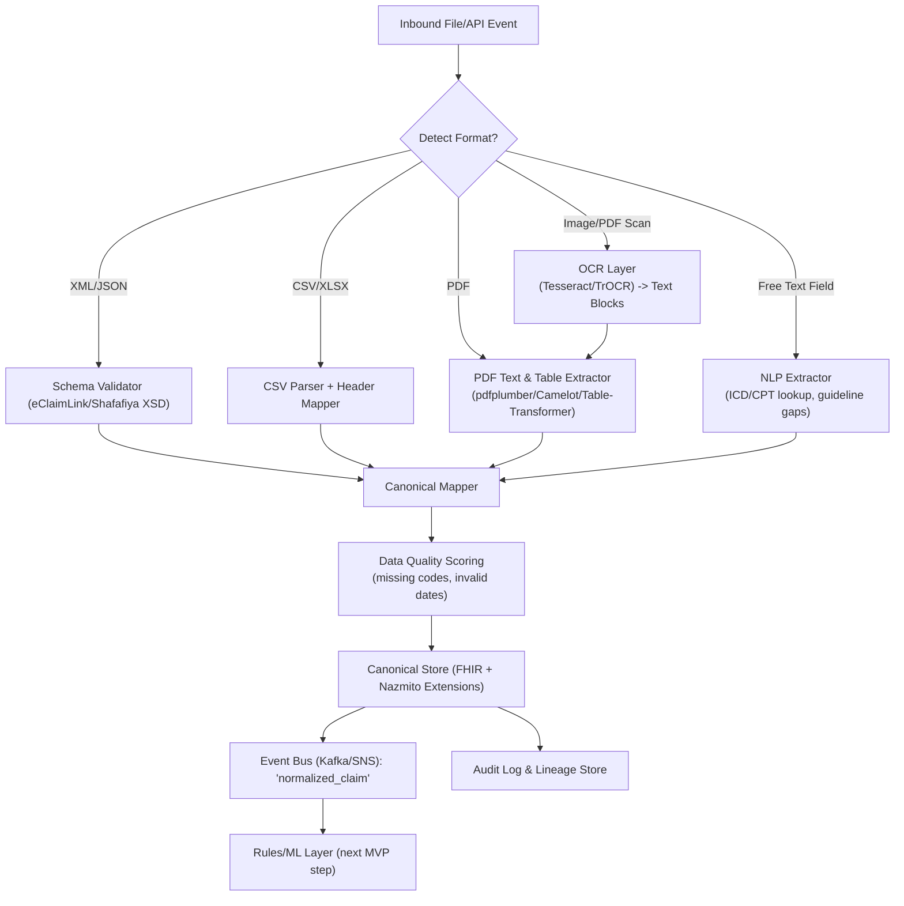

## 🛠️ Agent Quick-Start Guide

You are inside the **nazmito** repo (health-claims MVP). Some hints:

1. we use `uv` for package management.
2. write test cases in `tests/` for each step and confim it works as expected.

### Key Specs & Data References
- eClaimLink Common Types XSD – <https://www.eclaimlink.ae/dhd/commontypes_20191113_xsd.html>
- PriorAuthorization.xsd (repo path: `schemas/PriorAuthorization.xsd`)
- Shafafiya Prior-Request/Authorization dict – <https://www.doh.gov.ae/en/shafafiya/dictionary/Prior-Request-Authorization>
- FHIR overview – <https://hl7.org/fhir/overview.html>
- CMS DE-SynPUF sample claims – <https://www.cms.gov/data-research-statistics-trends-and-reports/medicare-claims-synthetic-public-use-files>
- PubTables-1M PDF tables – <https://huggingface.co/datasets/bsmock/pubtables-1m>
- DocBank scanned docs – <https://doc-analysis.github.io/docbank-page>
- Asclepius Synthetic Notes – <https://huggingface.co/datasets/starmpcc/Asclepius-Synthetic-Clinical-Notes>

### High-Level Architecture

---

## Phase 1 - Data Ingestion & Normalization & Audit UI

> Goal: a working end-to-end pipeline (file ingest → canonical JSON → audit UI) by **Day 14**. All tools use **uv** (https://github.com/astral-sh/uv) for dependency management.
>
> **Glossary** (learn these before Day 1)
> * **uv** – lightning-fast Python package manager & virtual-env tool (drop-in for *pip*).
> * **FHIR** – *Fast Healthcare Interoperability Resources* standard for healthcare data exchange.
> * **ICD-10** – *International Classification of Diseases* codes (diagnoses).
> * **CPT** – *Current Procedural Terminology* codes (services).
> * **UMLS** – *Unified Medical Language System* (master vocab).
> * **OCR** – *Optical Character Recognition* (turn images into text).
> * **TrOCR** – Transformer-based OCR model from Microsoft.
> * **Parquet** – columnar file format for analytics.
> * **Kafka** – high-throughput event bus.

---

### 📚 Pre-Sprint Reading (evenings before Day 1)
- HL7 intro to FHIR resources – <https://hl7.org/fhir/overview.html>
- eClaimLink Provider Manual (Sections 5 & 6) – <https://eclaimlink.ae/eClaimLink/Samples/eClaimLink_Provider_Manual.pdf>
- Shafafiya web-service dictionary – <https://www.doh.gov.ae/en/shafafiya/dictionary/Prior-Request-Authorization>
- Blog: "How to Validate XML with Python *xmlschema*" – <https://blog.datadive.io/xml-validation-python>
- Article: "Parsing Tables from PDFs with *pdfplumber*" – <https://towardsdatascience.com/>

---

### 🗓 Day 1 — Environment & Repo Bootstrap
- [x] Install **uv** (`curl -Ls https://astral.sh/uv/install.sh | sh`)
- [x] Create `.venv` via `uv venv .venv && source .venv/bin/activate`
- [x] `uv pip install --upgrade uv black ruff pytest`  → write `requirements.in`
- [x] Set up `pre-commit` (`uv pip install pre-commit && pre-commit install`)
- [x] Read: uv quick-start docs – <https://astral.sh/blog/uv-quickstart>

### 🗓 Day 2 — Canonical Schema Draft

> **Objective:** Establish a single, vendor-agnostic “source of truth” data model that every upstream format (XML, CSV, PDF-extracted JSON) can be transformed into. This *canonical schema* is a streamlined subset of the HL7 FHIR standard—augmented with Nazmito-specific fields—that captures only the attributes we need for the MVP (patient info, service requests, monetary amounts, diagnoses, dates, status). By mapping eClaimLink, Shafafiya, CMS CSV, and OCR/NLP outputs into this schema we (1) decouple parsing logic from downstream analytics and rules, (2) guarantee that every record—regardless of origin—looks the same to the quality scorer, Kafka event bus, and UI layers, and (3) future-proof the platform for interoperability with other FHIR-capable systems such as payer APIs or electronic medical records. Today’s work is therefore crucial: it defines the contract that all subsequent pipeline stages will rely on.

- [ ] 2.1 Review FHIR resources *Claim*, *ClaimResponse*, *ServiceRequest*, *Observation*, *MedicationStatement* (read spec links below)
- [ ] 2.2 Create mapping spreadsheet (`docs/mappings/field_map_v0.xlsx`) aligning eClaimLink/Shafafiya tags → FHIR fields
- [ ] 2.3 Define minimal MVP field list (patient, encounter, service, amount, diagnosis, status)
- [ ] 2.4 Draft JSON Schema `schemas/canonical_schema.json` (use `$schema":"https://json-schema.org/draft/2020-12/schema"`)
- [ ] 2.5 Add sample `canonical/examples/claim_example.json` conforming to schema
- [ ] 2.6 Write pytest `tests/test_canonical_schema.py` that loads example and validates with `jsonschema`
- [ ] 2.7 Update `README.md` with canonical schema overview and link to mapping doc
- [ ] 2.8 Commit and push branch `feat/canonical-schema` for PR review

### 🗓 Day 3 — XML Ingestion (eClaimLink)

> **Objective:** Prove end-to-end ingestion of a real-world UAE schema. We’ll take Dubai Health Authority’s eClaimLink *Prior Authorization Request* XML, validate it against its official XSD, and convert it into the canonical JSON we defined on Day 2. Deliverables include a reusable `XmlIngestor` class, unit tests, and at least one successfully normalized sample. This establishes the pattern all other format ingestors will follow and gives us concrete data to run through quality scoring and the UI later in the sprint.

- [ ] Move `/data_pipelines/eclaim_link.py` → `pipelines/xml_ingest.py` (class API)
- [ ] Validate sample `samples/prior_auth_request.xml` against `schemas/PriorAuthorization.xsd`
- [ ] Write 10 unit tests for mapper
- [ ] Dataset: request 5 sandbox XMLs from **Mohammad Al-Suwaidi** (DHA)
  Contact: mohammad@dha.gov.ae

### 🗓 Day 4 — XML Ingestion (Shafafiya)

> **Objective:** Expand XML coverage to Abu Dhabi’s Shafafiya standard, ensuring our pipeline can handle schema variations across UAE payers. We will implement support for the 2011 `Prior.Authorization` structure defined in `CommonTypes_20191113.xsd`, normalize it to the canonical schema, and create regression tests. Achieving dual-payer compatibility showcases interoperability to investors and sets a template for onboarding additional formats with minimal effort.

- [ ] Add 2011 schema support (`CommonTypes_20191113.xsd`)
- [ ] Unit tests for edge cases (multiple activities, missing codes)
- [ ] Dataset: download 3 example XMLs from Shafafiya docs portal

### 🗓 Day 5 — CSV Claims Path

> **Objective:** Demonstrate that the pipeline isn’t limited to XML by ingesting flat-file claims feeds common in many payer data exchanges. We’ll parse a small slice of the open CMS DE-SynPUF dataset and a handful of synthetic CSVs generated by Synthea, then map each row into the canonical schema. Successfully handling CSV proves versatility to investors and gives us a second modality (after XML) to run through the quality-scoring engine.
>
> **Dataset rationale:**
> • **CMS DE-SynPUF** (U.S. Medicare) is freely available, well-documented, and large enough to contain realistic claim line items (HCPCS/CPT, diagnosis, charge amounts). Although U.S. coding differs (ICD-10-CM vs. UAE ICD-10-AM), the column structure (patient ID, provider ID, service code, amount) mirrors what UAE payers transmit in CSV feeds, so field mapping effort is minimal.
> • **Synthea** generates fully synthetic patient journeys; we can configure its code system output to include *ICD-10-AM* or *CPT*-like procedure codes. This lets us create UAE-flavored examples without PHI.
> • **Adapting to UAE:** When real UAE CSV samples arrive, we swap the header mapping and extend the code-set translation layer; the ingestion logic itself remains unchanged.

- [ ] `uv pip install pandas`  → parse **CMS DE-SynPUF** (5 rows only)
- [ ] Generate 5 synthetic CSVs via **Synthea** (`brew install synthea && synthea -p 5`)
- [ ] Map to canonical JSON & tests
- [ ] Read: blog "Parsing Large CSVs Efficiently in Python" – <https://jakevdp.github.io/posts/python-csv-performance>

### 🗓 Day 6 — Data-Quality Rules

> **Objective:** Quantify trustworthiness of incoming data by codifying domain rules (e.g., no missing ICD-10, valid CPT codes, sensible dates/amounts). The quality score accompanies every record and will later feed investor-facing metrics dashboards. Today we’ll wire lookup tables from UMLS, implement rule checks, and build pytest coverage so future ingestors automatically inherit the same validation.
>
> **What are data-quality rules?** Simple boolean or numeric checks that flag bad or suspicious data. Examples:
> • *Completeness* – patient DOB present, service date present
> • *Conformance* – ICD-10 code exists in lookup; amount field is numeric
> • *Range/Logic* – service date ≤ today; amount > 0; start date ≤ end date
> • *Uniqueness* – record identifier not already ingested
>
> **ICD-10 refresher:** The *International Classification of Diseases, Tenth Revision* is a global diagnostic code set. Example codes:
> • **E11.9** – Type 2 diabetes mellitus without complications
> • **I10** – Essential (primary) hypertension
> • **S06.5X1A** – Traumatic subdural hemorrhage w/ LOC >24h, initial encounter
> UAE uses the *ICD-10-AM* variant; mappings can be loaded from the UMLS dump.

- [ ] Rules: missing ICD-10, invalid CPT, negative amounts, future dates
- [ ] Source code sets from **UMLS 2023AB** – <https://uts.nlm.nih.gov/> (register)
- [ ] Implement rule engine (`dq/checks.py`) + pytest coverage

### 🗓 Day 7 — PDF Table Extraction

> **Objective:** Tackle semi-structured documents by extracting tables from provider invoices and manuals. Using pdfplumber (text layout) and Camelot (lattice mode) we’ll convert table rows into structured JSON, then flow them into the canonical schema. Stress-testing on the PubTables-1M subset validates robustness and sets the stage for the OCR fallback on Day 8.
>
> **Why not LLM/vision today?** Day 7 assumes PDFs already contain embedded vector text or clear table borders. For scanned images or complex layouts we’ll introduce computer-vision OCR and potentially transformer-based *vision-language* models (*e.g.* TrOCR) **tomorrow in Day 8**. Separating the concerns keeps scope manageable and lets us benchmark traditional table extractors first.

- [ ] `uv pip install pdfplumber camelot-py[cv]` (needs poppler)
- [ ] Extract tables from eClaimLink Manual (Section 6 examples)
- [ ] Stress test on 50 PDFs from **PubTables-1M** subset – <https://huggingface.co/datasets/bsmock/pubtables-1m>
- [ ] Read: Medium article "Camelot vs. Tabula" – <https://medium.com/>

### 🗓 Day 8 — OCR Fallback

> **Objective:** Unlock the ability to ingest *scanned* or *faxed* documents that have no embedded text layer—common in UAE provider workflows where approvals are printed, stamped, and re-uploaded. We will integrate two complementary OCR approaches:
> 1. **Tesseract 5.x** with English + Arabic language packs for fast, on-CPU text extraction. Ideal for clear, high-contrast scans (e.g., black-and-white forms).
> 2. **TrOCR-base** (Vision-Encoder/Decoder Transformer) running on GPU for tough cases—low resolution, skewed, or colored stamps. TrOCR provides state-of-the-art accuracy by jointly reasoning over image patches and text tokens.
>
> Pipeline wiring today:
> • Detect whether a PDF page lacks text via pdfplumber’s `char_margin` heuristic → if yes, route page images to OCR.
> • Post-process OCR output with rule-based line merging, remove headers/footers, and feed into the **PDF Table Extraction** flow from Day 7 (tables may appear after OCR).
> • Emit a JSON object `{page, ocr_text, bbox_coords}` and attach to the *bronze* layer for audit.
> • Map any recovered structured data (e.g., Activity Code table) into canonical schema.
>
> **Investor value:** Demonstrates robustness against real-world, low-quality uploads and shows that we can handle Arabic content—critical for regional deployment. Produces compelling before-and-after screenshots for the pitch deck.

- [ ] `uv pip install pytesseract torch torchvision`
- [ ] Install Arabic traineddata (`wget https://github.com/tesseract-ocr/tessdata_best/.../ara.traineddata -P /usr/share/tessdata`)
- [ ] Integrate Tesseract fallback in `pipelines/pdf_ingest.py`
- [ ] Prototype TrOCR inference script for 10 pages from **DocBank** + 5 partner scans
- [ ] Save OCR JSON alongside PDF metadata; write unit test that asserts non-empty text for scanned sample

### 🗓 Day 9 — NLP on Justification Text

> **Objective:** Extract clinically meaningful signals from free-text fields such as *JustificationText*, *Comments*, or physician notes—essential for automated approval rules in later phases. We will:
> 1. **Rule-based extraction** for quick wins (regex on ICD/CPT mentions, negation patterns, "failed conservative therapy").
> 2. **Fine-tune an LM**: Use Hugging Face’s distilled `bert-mini` (~11 M params) as a Named-Entity-Recognition (NER) model to capture diagnoses, medications, and procedures. Training corpus: **Asclepius Synthetic Notes** (labeled) augmented with 200 hand-tagged snippets from UAE XMLs.
>
> Processing flow:
> • Clean text (Unicode normalize, strip PHI placeholders).
> • Run rule-based extractor → tag obvious entities.
> • Feed residual text to fine-tuned BERT for NER slots.
> • Map entities to canonical schema fields (`justification.diagnosisCodes`, `justification.previousTreatments`) using ICD-10 & CPT lookups.
> • Emit confidence scores; flag anything <0.7 for manual review in the UI.
>
> **Why this matters:** Prior-auth decisions hinge on narrative justification. Automating its parsing reduces manual nurse review time and showcases advanced NLP capability—an investor differentiator.

- [ ] `uv pip install transformers datasets`
- [ ] Prepare training data: convert Asclepius JSON → CoNLL format + add UAE snippets
- [ ] Fine-tune `bert-mini` for 3 epochs on GPU; log F1 ≥ 0.85
- [ ] Implement `nlp/extract_justification.py` returning entity list + confidence
- [ ] Pytest with sample texts; ensure mapping into canonical JSON
- [ ] Update quality rules to drop into "needs-review" queue when NLP confidence low

### 🗓 Day 10 — Bronze/Silver/Gold Storage & Kafka

> **Objective:** Formalize our data lake and real-time event backbone so every downstream consumer—dashboards, rules engine, future AI agents—receives consistent, traceable data. We’ll implement a **medallion architecture**:
> • **Bronze** – raw artifacts (original XML/CSV/PDF + OCR JSON) stored verbatim; immutable, SHA-256 hashed.
> • **Silver** – cleaned but source-shaped data (e.g., flattened XML, parsed CSV) with basic type casting.
> • **Gold** – fully normalized canonical JSON conforming to `canonical_schema.json` plus quality-score metadata.
> Files will be written as columnar **Parquet** partitions (`/data/{layer}/ingest_date=*`) for efficient analytics.
>
> In parallel we’ll stand up a **local Kafka cluster** (Docker) and publish a `normalized_claim` topic for each Gold record. This enables near-real-time subscriptions (e.g., rule engine, BI, or chat agent) without polling storage.
>
> **Audit & compliance value:** Immutability + hashes support regulatory traceability; clear layering accelerates debugging and data science exploration.

- [ ] `uv pip install pyarrow fastparquet confluent-kafka`
- [ ] Create directory structure `/data/{raw|clean|normalized}`
- [ ] Implement Parquet writer utility in `storage/medallion.py`
- [ ] Compute SHA-256 and store alongside each file in `.manifest` JSON
- [ ] Docker Compose services: `kafka`, `zookeeper`; configure topic `normalized_claim`
- [ ] Publish Gold JSON to Kafka after each successful ingest; integration test with `kafkacat`
- [ ] Update README with medallion diagram and consumer example

### 🗓 Day 11 — Audit UI (Streamlit)

> **Objective:** Give stakeholders a visual window into the pipeline—vital for trust and demo flair. The Streamlit app will:
> 1. **Upload & Parse Tab:** drag-and-drop a file → backend calls ingestion pipeline → displays status, elapsed time, data-quality score.
> 2. **Diff Viewer Tab:** side-by-side Raw (Bronze) vs. Normalized (Gold) JSON with color-coded highlights using `deepdiff`.
> 3. **Search / Filter Tab:** simple full-text search over Gold Parquet (DuckDB) so users can query by diagnosis, service code, etc. (lays groundwork for vector search Phase 2).
> 4. **Quality Dashboard:** bar chart of pass/fail counts, average score, most common rule violations.
>
> **Technical stack:** Streamlit front-end, FastAPI backend endpoints (`/ingest`, `/claim/{id}`, `/search`). Communication via REST; backend reads Parquet Gold or consumes from Kafka for live updates.
>
> **Investor impact:** Visual proof of end-to-end flow in <30 s; showcases transparency and analytics readiness.

- [ ] `uv pip install streamlit deepdiff duckdb pandas`  # duckdb for fast local SQL over Parquet
- [ ] Create `ui/app.py` with four tabs described above
- [ ] Implement diff component using `deepdiff` → HTML diff
- [ ] Wire upload endpoint to FastAPI service started on Day 12 (temporary local call)
- [ ] Query Gold layer via DuckDB for Search tab; show first 100 matches
- [ ] Dashboard plots with Streamlit `st.chart`
- [ ] Add pytest `tests/test_ui_smoke.py` to ensure app starts
- [ ] Update `docker-compose.yml` to include `ui` service exposed on port 8501

### 🗓 Day 12 — REST API (FastAPI)

> **Objective:** Expose the normalized data and ingestion actions via a production-ready HTTP interface so external systems—or demo scripts—can interact with the platform programmatically. The API will: (1) provide CRUD-like access to Gold records (`GET /claim/{id}`, `GET /claims?query=`), (2) offer an `/ingest` endpoint used by the Streamlit UI’s upload tab, and (3) stream recent events with Server-Sent Events (`/events/normalized`) by tailing the Kafka topic. We’ll ship auto-generated Swagger / OpenAPI docs, simple **Basic Auth** middleware (enough for MVP), and Docker healthchecks.
>
> **Business value:** Investors and integration partners can test the system without seeing the codebase—just hit the API. It also sets the stage for microservices that consume normalized data (e.g., rule engine, AI chat agent).

- [ ] `uv pip install fastapi uvicorn[standard] python-multipart` (file uploads)
- [ ] Create `api/main.py` with routers: `ingest`, `claim`, `search`, `events`
- [ ] Hook `/ingest` to pipeline orchestrator; return job ID + status
- [ ] Implement Kafka consumer that forwards JSON to SSE endpoint
- [ ] Add pydantic models mirroring `canonical_schema.json` for type safety
- [ ] Enable Swagger UI at `/docs`; add example requests
- [ ] Basic Auth via `fastapi.security.HTTPBasic` + env var credentials
- [ ] Add pytest `tests/test_api_routes.py`
- [ ] Add `api` service to `docker-compose.yml` listening on 8000 with healthcheck

### 🗓 Day 13 — Investor Demo Packaging

> **Objective:** Bundle the entire stack—API, UI, Kafka, pipeline worker, and sample datasets—into a one-command deployment so an investor or advisor can run the demo on their laptop or a cloud VM. We’ll use **Docker Compose** to orchestrate services and a `Makefile` for convenience tasks (build, run, ingest-sample, clean). Screenshots, an architecture diagram, and clear instructions will be added to the README.
>
> **Success criteria:** `make demo` spins up containers, seeds three sample files, and the user can (a) view them in the Audit UI, (b) fetch via REST, and (c) see that Kafka messages are flowing—all within five minutes.

- [ ] Write `docker-compose.yml` with services: `api`, `ui`, `kafka`, `zookeeper`, `worker` (celery or simple loop)
- [ ] Build minimal production Dockerfiles (`python:3.11-slim` + uv sync)
- [ ] Makefile targets: `demo`, `ingest-sample`, `stop`, `clean`
- [ ] Seed script `scripts/load_samples.py` publishes XML, CSV, PDF scan
- [ ] Capture UI screenshots and save to `docs/assets/`
- [ ] Generate Mermaid architecture diagram -> PNG and embed in README
- [ ] Smoke-test on a fresh clone; document any gotchas

### 🗓 Day 14 — Dry-Run & Pitch Assets

> **Objective:** Validate the full MVP under realistic conditions and package all collateral for the investor pitch. Activities include latency benchmarking, quality-score analysis, video recording, and final documentation polish.
>
> • **E2E Test:** Ingest 1 XML, 1 CSV, 1 scanned PDF; ensure canonical JSON produced, UI displays diff, API returns 200, Kafka offsets advance.
> • **KPIs:** Latency ≤30 s from upload to Gold; mean quality score ≥0.8; rule failures <10 %.
> • **Assets:** 3-min Loom video walkthrough, GIF of diff viewer, metrics slide, and one-pager describing medallion + AI roadmap.
>
> **Deliverable:** A shareable GitHub repo link + Docker Compose and assets that an investor can run and review independently.

- [ ] Run end-to-end script `scripts/e2e_smoke.sh`; export timing metrics
- [ ] Generate `metrics/report.md` with KPI tables and graphs (matplotlib)
- [ ] Record Loom video demo; store link in README
- [ ] Update pitch deck slide with screenshots and KPI numbers
- [ ] Final README polish: quick-start, tech stack, roadmap Phase 2 (AI search)
- [ ] Tag git release `v0.1-mvp`

---

### Cross-Cutting (Do Anytime)
- [ ] GitHub Actions CI: lint, tests on push
- [ ] LICENSE & NOTICE for datasets, models
- [ ] Continuous reading list: bookmark every spec or blog you touch and add to `docs/reading_list.md`

---

## 🚀 Phase 2 – Smart Retrieval & AI Agent (Weeks 3–4)

> **Vision:** Turn the normalized data lake into an interactive knowledge platform. We’ll leverage **KuzuDB** (embedded graph DB with vector support), **LangGraph** for declarative LLM workflows, and **BAML** for structured prompt/agent definitions.

### Week 3 – Semantic Index & Search API

**Objective:** Enable fast keyword *and* semantic retrieval across Gold records using KuzuDB’s vector index.

- [ ] **Day 15–16: Embedding Generation**
  • `uv pip install sentence-transformers kuzu`
  • Encode Gold JSON (`claim_id + service text + diagnosis text`) with `intfloat/e5-small`.
  • Create Kuzu database `kuzu/claims.kuzu`; write `Claim` nodes with properties `id`, `text`, `embedding` (vector).
  • Create cosine similarity index on `embedding` column.
- [ ] **Day 17: Search Endpoint & UI Tab**
  • Extend FastAPI with `GET /search?q=`: encode query → Kuzu vector search + fallback BM25 via DuckDB.
  • Add *Semantic Search* tab in Streamlit—top-k results with highlight snippets.
- [ ] **Day 18: Relevancy Evaluation**
  • Generate 20 query–result pairs; compute nDCG.
  • Iterate on prompt-embedding or hybrid retrieval as needed.

### Week 4 – Conversational Agent & Graph Reasoning

**Objective:** Provide an AI assistant that answers questions like “Why was claim 123 denied?” using LangGraph + Kuzu knowledge graph.

- [ ] **Day 19–20: Graph Construction**
  • Define Kuzu schema: `Patient`, `Claim`, `Service`, `Diagnosis` nodes; relationships `HAS_SERVICE`, `HAS_DIAGNOSIS`.
  • Import 100 claims; verify Cypher-like queries (`MATCH (c:Claim)-[:HAS_DIAGNOSIS]->(d) WHERE d.code='E11.9' RETURN c`).
- [ ] **Day 21: LangGraph + BAML RAG Pipeline**
  • `uv pip install langgraph baml openai`
  • Use BAML to declare agents: `Retriever`, `Reranker`, `AnswerGenerator`.
  • Compose with LangGraph: user Q → Retriever (vector + graph walk) → Reranker → AnswerGenerator (OpenAI GPT-3.5) → Response.
  • Return JSON `{answer, sources}`.
- [ ] **Day 22: Chat UI & API**
  • Add `/chat` WebSocket endpoint; Streamlit chat component using LangGraph chain.
  • Expandable citation cards showing Kuzu record snippets.
- [ ] **Day 23: Guardrails & Monitoring**
  • Add BAML policies: max tokens, allowed content; PHI leak regex.
  • Log prompt/response pairs to Parquet.
- [ ] **Day 24: Investor Demo v2**
  • Script: “List diabetic claims with hypertension meds” → semantic search.
  • “Explain denial reason for claim X” → chat agent citing rule outputs and graph paths.
  • Update deck with screen recordings & graph visualization.

---

### Post-Phase 2 Backlog (Not yet scheduled)
- Rules/ML layer for auto-approve/deny logic
- Real-time alerting (Kafka → Slack) for low-quality ingests
- Multi-tenant auth & RBAC
- Integration with payer FHIR APIs for push-out
