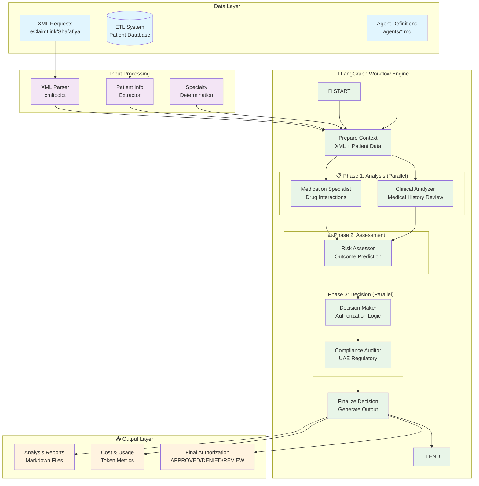
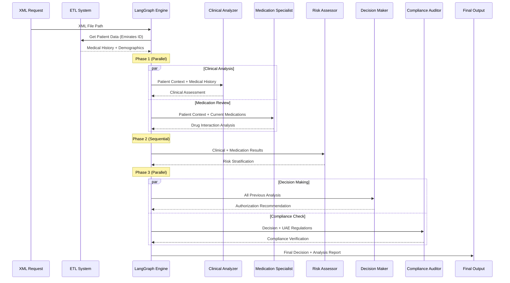

# UAE Pre-Authorization Analysis System (LangGraph)

AI-powered healthcare decision support system for UAE insurance pre-authorization analysis using specialized Claude Code agents orchestrated with **LangGraph**.

## System Architecture



## Agent Data Flow



## Quick Start

### Using LangGraph Agent

```bash
# Install dependencies (from project root)
uv add langgraph claude-code-sdk loguru xmltodict

# Python usage
python -c "
from claude_preauth_system.agent import PreAuthAgent
agent = PreAuthAgent()
results = agent.process_xml_request('path/to/request.xml', 'eclaim')
print(f'Decision: {results[\"final_decision\"][\"decision\"]}')
"
```

### LangGraph Studio (Visualization & Debugging)

```bash
# Install LangGraph CLI
pip install langgraph-cli

# Start LangGraph development server (with hot reloading)
cd claude_preauth_system
langgraph dev --port 8123 --host 0.0.0.0

# Alternative: Use tunnel for remote access
langgraph dev --tunnel

# Access LangGraph Studio UI
open http://localhost:8123

# Or access via LangSmith (if using tunnel)
# Visit https://smith.langchain.com and connect to your running server
```

## System Components

### Core LangGraph Components
- **agent.py** - Main PreAuthAgent class wrapping LangGraph workflow
- **graph.py** - LangGraph StateGraph definition with nodes and edges
- **state.py** - Comprehensive state schema for workflow management
- **utils.py** - Utility functions for XML parsing and agent execution
- **langgraph.json** - Configuration for LangGraph Studio and deployment

### Specialized Medical Agents (5)
- **clinical-analyzer** - Medical history review, disease progression analysis
- **medication-specialist** - Drug interactions, safety assessment, contraindications  
- **risk-assessor** - Clinical risk stratification, outcome prediction
- **decision-maker** - Evidence-based authorization recommendations
- **compliance-auditor** - UAE regulatory compliance verification

### Data Processing
- **XML Processing**: eClaimLink (Dubai) and Shafafiya (Abu Dhabi) formats
- **ETL Integration**: Patient data retrieval from processed datasets
- **Specialty Detection**: Automatic medical specialty determination
- **Context Preparation**: Shared data context for all agents

## Agent Execution Phases

### Phase 1: Initial Analysis (Parallel)
- **Clinical Analyzer**: Reviews medical history, analyzes disease progression
- **Medication Specialist**: Evaluates drug interactions and safety profiles

### Phase 2: Risk Assessment (Sequential)
- **Risk Assessor**: Performs clinical risk stratification based on Phase 1 results

### Phase 3: Decision & Compliance (Parallel)
- **Decision Maker**: Makes evidence-based authorization recommendations
- **Compliance Auditor**: Verifies UAE healthcare regulatory compliance

## Data Types & Sources

| Data Source | Type | Agent Usage | Output |
|-------------|------|-------------|---------|
| XML Request | eClaimLink/Shafafiya | All Agents | Service requests, costs |
| ETL Database | Patient Demographics | Clinical, Risk | Age, gender, medical history |
| ETL Database | Lab Results | Clinical, Risk | Recent test results, trends |
| ETL Database | Medications | Medication, Risk | Current prescriptions, history |
| ETL Database | Claims History | All Agents | Previous authorizations |
| Agent Definitions | Markdown Instructions | Individual Agent | Specialized analysis prompts |

## LangGraph Features

### Visualization & Debugging
- **Graph Visualization**: Interactive workflow diagram
- **State Inspection**: Real-time state monitoring
- **Breakpoints**: Pause execution at any node
- **Time Travel**: Replay and modify workflow history
- **Streaming**: Real-time execution updates

### Workflow Management
- **Checkpointing**: Automatic state persistence
- **Error Handling**: Graceful failure recovery
- **Parallel Execution**: Within-phase concurrent processing
- **Conditional Routing**: Dynamic workflow paths
- **Cost Tracking**: Token usage and expense monitoring

## Example Usage

```python
from claude_preauth_system.agent import PreAuthAgent

# Create agent with checkpointing
agent = PreAuthAgent()

# Process XML request
results = agent.process_xml_request(
    xml_file_path="data/UAE_XML/patient_001_eclaim.xml",
    xml_format="eclaim",
    thread_id="patient_001_analysis"
)

# Stream processing with real-time updates
for update in agent.stream_xml_request(
    xml_file_path="data/UAE_XML/patient_002_eclaim.xml", 
    xml_format="eclaim",
    stream_mode="values"
):
    print(f"Update: {update}")

# Get workflow visualization
graph = agent.get_workflow_graph()
graph.draw_png("workflow.png")
```

## Output Files

Each analysis generates:
- **Final Decision**: Authorization status with confidence score
- **Agent Results**: Individual specialist analysis reports
- **Cost Tracking**: Token usage and processing costs
- **Workflow Metadata**: Execution times and state transitions
- **Analysis Reports**: Comprehensive markdown documentation

## Configuration

Customize via `langgraph.json`:
- Agent tool permissions
- Execution timeouts and limits
- Breakpoint configurations
- Streaming modes
- Studio UI themes
- Monitoring and tracing

## Development & Debugging

### LangGraph Studio Features
1. **Interactive Workflow**: Visual graph with clickable nodes
2. **State Inspector**: Real-time state variable monitoring
3. **Execution Replay**: Time travel through workflow history
4. **Breakpoint Debugging**: Pause and inspect at any step
5. **Performance Metrics**: Execution times and resource usage

### Testing & Validation
```bash
# Test graph creation
python claude_preauth_system/graph.py

# Test agent execution
python claude_preauth_system/agent.py

# Validate BAML functions
python -m pytest baml_src/tests/
```

## Complete Documentation

See [`../docs/claude_preauth_system.md`](../docs/claude_preauth_system.md) for:
- Detailed system architecture
- Agent specializations and capabilities
- UAE healthcare compliance features
- Installation and configuration guide
- Advanced usage patterns
- Troubleshooting and maintenance